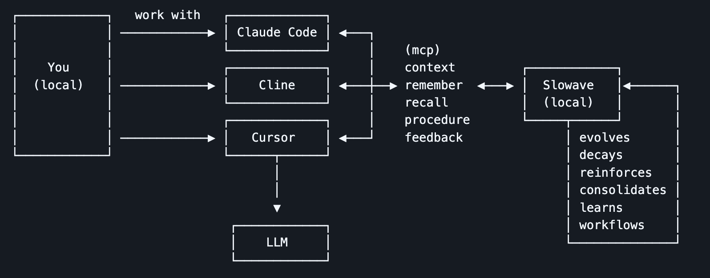

# Slowave

> **Private memory for AI tools.** Install it once, keep using Claude Code, Cline, Cursor, Windsurf, Claude Desktop, or any MCP client, and they share one local memory of your work, decisions, preferences, and history.

[](https://pypi.org/project/slowave/)
[](https://pypi.org/project/slowave/)
[](https://pypi.org/project/slowave/)
[](LICENSE)
[](https://pepy.tech/project/slowave)

AI tools are powerful, but their memory is still fragmented. A lesson learned in one chat disappears in the next. A project convention remembered by Claude Code is unknown to Cline. A debugging scar from last week has to be explained again.

Slowave gives your AI clients a shared memory layer: local, private, inspectable, and **$0 per query**. You do not chat with Slowave. Your clients call it for you, so they can build durable context about you and your work over time.

## What it feels like


You keep using your AI client normally.

- At the start of a task, the client asks Slowave for relevant context.
- As you work, durable decisions, preferences, lessons, and workflows can be stored.
- During the task, the client can ask Slowave for specific memory when its reasoning needs it.
- Later, another client can recall the same memory, even in a different session or project.

The result: your clients stop treating you like a stranger. They can reuse what Slowave has learned about your projects, decisions, preferences, historical work, debugging scars, and recurring choices. Nothing leaves your machine.

You may see `slowave_*` tool calls in the trace. That is the integration working.

## The memory gets better with use

Slowave is not just a note bucket. It consolidates.

A single interaction becomes an episode. Related episodes become prototypes. Repeated prototypes become schemas. Useful memories strengthen; stale ones decay; outdated facts can be superseded. Over time, project-specific lessons can become general concepts your clients surface elsewhere.

That is the compounding loop:

```text
use your AI tools → Slowave stores durable signals → offline consolidation
                 → better context next time → better feedback → stronger memory
```

The first day, Slowave may remember a fact. After a month, it starts to feel like your tools know the parts of you that matter for work: your projects, preferences, decisions, conventions, debugging history, and recurring choices.

## How memory gets invoked

### 1. Transparent learning

Your clients feed Slowave as you work: architectural decisions, recurring bugs, project conventions, user preferences, open questions, and repeated workflows. You do not manage this manually; the client invokes Slowave when the lifecycle calls for it.

### 2. Explicit memory hints

Sometimes you tell your AI client that something should persist. The exact wording does not matter; the client decides whether to store it in Slowave.

> “Remember that deploys require the secrets env var set, or the worker crashes on boot.”

That is just one example. “Keep this in mind”, “we should not forget”, “for next time”, or a project-specific rule can all lead the client to encode memory.

### 3. Client-initiated recall

Your client can also query Slowave whenever it needs memory for the task — even if you did not explicitly ask for recall. If it is debugging auth, planning a migration, or checking a project convention, it can ask Slowave for relevant prior context during its own reasoning.

> “What do you remember about how we handle auth token refresh?”

That kind of prompt is only a visible example. In normal use, the recall often happens because the client decides memory would help. Slowave returns relevant project decisions, prior bugs, preferences, constraints, and lessons it has consolidated.

## Why it is different

Slowave is built on one claim:

> **Memory consolidation does not require language.**

The LLM verbalizes retrieved memory; it does not operate on memory itself. Ingestion, consolidation, reinforcement, decay, supersession, and recall run locally as memory mechanisms over embeddings.

That gives you:

- **One memory across tools** — Claude Code, Cline, Claude Desktop, Cursor, Windsurf, and any MCP-compatible client share the same store.
- **Fully local memory** — no cloud backend, no external memory service, no Ollama, no vector database to run.
- **Zero LLM calls for memory operations** — consolidation and recall run locally, at $0 per query.
- **Compact context instead of history replay** — internal tests showed **86% smaller context** over 20 sessions while preserving expected recall quality. [See the token-efficiency test →](docs/token_efficiency.md)
- **Feedback-shaped recall** — useful memories strengthen; irrelevant, stale, or wrong memories can be suppressed.
- **Scoped memory** — project, domain, relationship, or universal context. Cross-project bleed is prevented by default.

[Design rationale →](docs/design.md) · [Architecture →](docs/architecture.md)

## Install

```bash
pipx install slowave
# or
brew tap mrsalty/slowave https://github.com/mrsalty/slowave && brew install slowave
```

Then wire every client Slowave can find:

```bash
slowave setup --dry-run   # see what will change
slowave setup             # configure clients, lifecycle hooks, and worker
slowave doctor            # verify installation
```

`slowave setup` is idempotent and safe to re-run. Claude Desktop and Cursor need one manual paste because their instruction surfaces are not programmatically editable; `slowave setup` prints the exact text and path. [Full install guide →](docs/install.md)

The default text encoder downloads its model from HuggingFace on first use (~45 MB); later runs work offline.

Memory lives at `~/.slowave/slowave.db`, a plain SQLite file. It is local and inspectable, but unencrypted by default. If you store sensitive information, protect it with OS-level permissions or full-disk encryption.

## Benchmarks

All Slowave runs: zero LLM calls, local CPU, no API key.

| Benchmark | What it tests | Slowave |
|---|---|---:|
| LongMemEval | Facts, updates, preferences across many sessions with realistic distractors | **87.8%** |
| LoCoMo | Cross-session recall across real conversations, 5 categories | **76%** |
| StaleMemory | Detecting when a stored preference has silently changed | **86–89%** |

> Alpha-stage results. Internal runs, not independently verified. Slowave scores with keyword-overlap; most competitors use an LLM-as-judge, so numbers are not directly comparable. [Full benchmarks →](docs/benchmarks.md)

## Honest limits

Slowave is alpha software. It is useful today, but it is deliberately not an LLM-based reasoning layer.

- It recalls what was stored; it does not infer unstated preferences.
- It retrieves individual memories; it does not do cross-session counting or arithmetic.
- Contradiction detection is heuristic, not guaranteed.
- It is not safety-critical memory infrastructure.

These are trade-offs of the zero-LLM design, not hidden features. [Known limitations →](docs/limitations.md)

## What it is not

Slowave is not a language model, reasoning engine, or agent framework. Your AI client still plans, reasons, writes code, executes tools, and answers you. Slowave is the memory layer underneath it.

It is also not a markdown file manager, static RAG system, or LLM wrapper over a vector database. Memory changes through reinforcement, decay, supersession, consolidation, and feedback before it is rendered back into language.

## The big picture



## Dashboard

Watch memory compound through a local web UI: inspect what Slowave has learned, search recall, and see the memory graph grow as sessions consolidate.


## Documentation

- **[design.md](docs/design.md)** — the brain-inspired rationale. Read this first if you want to understand *why*.
- **[architecture.md](docs/architecture.md)** — how consolidation works.
- **[install.md](docs/install.md)** — install, setup, per-client wiring, troubleshooting.
- **[benchmarks.md](docs/benchmarks.md)** — per-category results, strengths, known gaps, reproducibility.
- **[limitations.md](docs/limitations.md)** — capability gaps and design trade-offs.
- **[token_efficiency.md](docs/token_efficiency.md)** — context size vs. history replay and static knowledge files.
- **[slowave_setup.md](docs/slowave_setup.md)** · **[manual_setup.md](docs/manual_setup.md)** · **[cli.md](docs/cli.md)** · **[dashboard.md](docs/dashboard.md)** — reference.

## Contributing

Open source under AGPL-3.0-or-later. Bug reports, install feedback, and focused improvements are welcome — read [CONTRIBUTING.md](./CONTRIBUTING.md) before opening a PR. Commercial licensing terms may be offered in the future.
