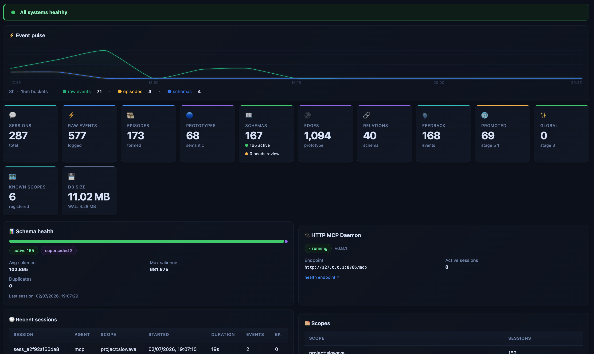
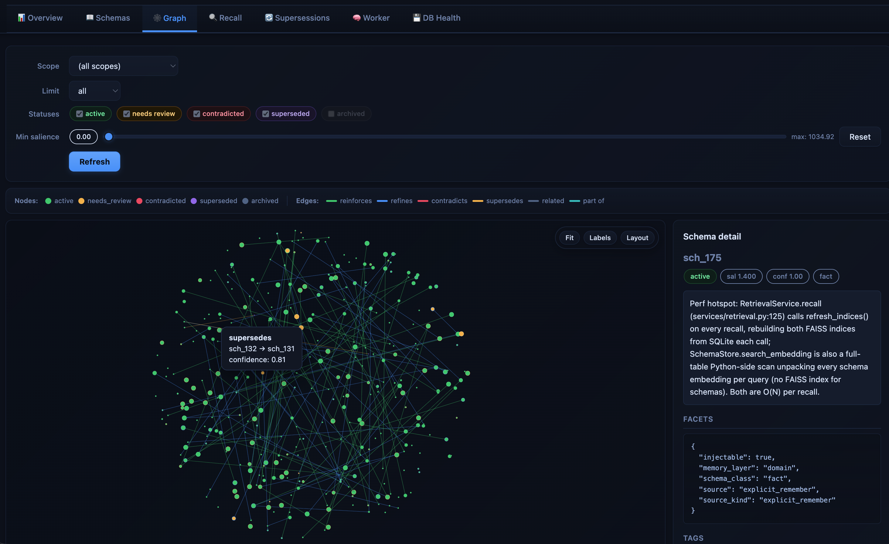

# Slowave

**A living local memory layer across your AI tools.**

Install once. Your AI tools share a persistent local memory across sessions and clients.

Slowave continuously adapts to your work — capturing decisions, preferences, and context over time.

- No additional LLM calls for memory operations
- No data leaves your machine

[](https://pypi.org/project/slowave/)
[](https://pypi.org/project/slowave/)
[](https://pypi.org/project/slowave/)
[](LICENSE)
[](https://pepy.tech/project/slowave)

---

## How it feels like


You work daily with your AI tools:

- **Day 1** — cold start: Slowave bootstraps memory from existing markdown knowledge, initializing the embedding-based memory state.
- **Week 1** — emerging patterns: new interactions begin reinforcing relevant signals, forming stable associations.
- **Month 1** — context consolidates: frequently reinforced information becomes consistently retrievable, low-signal data fades.
 
Multiple AI clients continuously build and reuse the same evolving memory over time:
- no markdown management
- no static RAG
- no LLM extra calls

---

## What you gain over time

Slowave becomes more useful the more you use it.

- **Less repetition** — you stop re-explaining the same context across sessions
- **Faster continuity** — returning to a project feels like resuming, not restarting
- **Cross-tool consistency** — your working context follows you across AI clients
- **Persistent working memory** — decisions, patterns, and preferences are retained beyond individual chats
- **Lower cognitive overhead** — no need to maintain external memory files or prompt scaffolding

Slowave does not just store information — it compounds it into usable context.

The result is a continuous working context that follows you across tools and time.

---

## Why Slowave is different

Slowave is a brain-inspired architecture.

### Principle

The human brain does not need language to remember: experiences are encoded, replayed during sleep, abstracted into patterns, and strengthened or forgotten.

Language acts as the interface, not the storage medium.

Slowave mirrors this separation: the language model is a client of memory, not the memory system itself. Memory activity — consolidation, ranking, decay, retrieval — operates over embeddings rather than rewritten text.

### Biological mapping

| Human brain | Slowave | What it does |
|---|---|---|
| Hippocampus | Episodic layer | Captures individual experiences as they happen |
| Neocortex | Semantic layer | Extracts recurring patterns across many experiences |
| Slow-wave sleep | Offline consolidation | Replays and groups episodes into prototypes, without the LLM |
| Spreading activation | Graph-based retrieval | Activation propagates across associations; partial cues recover whole memories |
| Hebbian reinforcement | Recall reinforcement | Memories that prove useful strengthen; unused ones fade |
| Reconsolidation | Post-retrieval feedback | Recalling a memory reopens it — feedback can strengthen, suppress, or supersede |

> [Design rationale](docs/design.md)
> 
> [Architecture](docs/architecture.md)

---

## Installation

Install Slowave:

```bash
pipx install slowave

# or

brew tap mrsalty/slowave https://github.com/mrsalty/slowave
brew install slowave
```

Configure every supported client:

```bash
slowave setup --dry-run
slowave setup
slowave doctor
```

`slowave setup` is idempotent and safe to run multiple times.

Claude Desktop and Cursor require one manual paste because their instruction surfaces cannot currently be modified programmatically. During setup, Slowave prints the exact text and destination path.

See the complete installation guide:

- [docs/install.md](docs/install.md)

The default embedding model is downloaded from Hugging Face on first use (~45 MB). Subsequent runs work offline.

Memory is stored locally as a SQLite database:

```
~/.slowave/slowave.db
```

The database is fully inspectable and remains on your machine. It is not encrypted by default, so sensitive information should be protected using normal operating system permissions or full-disk encryption.

---

## Dashboard

Inspect stored memories, browse recall results, visualize relationships, and observe consolidation over time.



Watch memory evolve through the local dashboard.



---

## Supported clients

Work in progress — suggest more integrations or report broken ones with setup details.

✅ = manually verified · ⬜ = pending verification

| Client         | macOS | Linux | Windows | Setup                                    |
|----------------|--|--|--|------------------------------------------|
| Claude Code    | ✅ | ✅ | ✅ | `slowave setup --client claude-code`     |
| Cline          | ✅ | ✅ | ✅ | `slowave setup --client cline`           |
| Cursor         | ✅ | ✅ | ⬜ | `slowave setup --client cursor` ¹        |
| Windsurf (Devin)    | ✅ | ✅ | ⬜ | `slowave setup --client windsurf`        |
| Claude Desktop | ✅ | ✅ | ✅ | `slowave setup --client claude-desktop` ¹ |
| OpenCode       | ✅ | ⬜ | ⬜ | `slowave setup --client opencode`        |
| All the above  |  |  |  | `slowave setup`                          |

¹ requires one manual paste after setup

---

## Benchmarks

Benchmarks were run internally during development to evaluate recall quality, stability, and context efficiency. Results have not yet been independently reproduced.

Slowave does not use an LLM for memory operations; all evaluation is based on embedding retrieval and local consolidation.

| Benchmark | What it evaluates | Scorer | Result |
|---|---|---|---:|
| LongMemEval | Multi-session factual recall with noise and distractors | keyword-overlap / local | 87.8% |
| LoCoMo | Cross-session conversational recall across categories | keyword-overlap / local | 74.6% |
| StaleMemory | Detection of outdated or superseded preferences | keyword-overlap / local | 45% overall; 86–89% for concrete preferences |

These results are not directly comparable with systems that use LLM-as-a-judge scoring, since Slowave relies on embedding-based matching metrics.

Full benchmark methodology and reproducibility details:
- [docs/benchmarks.md](docs/benchmarks.md)

---

## Honest limits

Slowave is useful in practice but intentionally constrained by its design.

- It recalls stored information; it does not infer missing preferences.
- It retrieves relevant memories; it does not perform reasoning over memory graphs.
- Contradiction handling is heuristic and may not always resolve conflicts correctly.
- It is not designed for safety-critical or compliance-critical memory use cases.
- Memory quality depends on the quality and consistency of prior interactions.

These limitations are a direct consequence of the zero-LLM memory design rather than implementation gaps.

See: [docs/limitations.md](docs/limitations.md)

---

## What it is not

Slowave is not:

- a language model
- an agent framework
- a reasoning system
- a prompt manager
- a markdown-based memory store
- a vector database wrapper

The AI client remains responsible for planning, reasoning, and execution.

Slowave only provides persistent, evolving context injection based on prior interactions.

---

## Documentation

- [design.md](docs/design.md) — design rationale, boundaries, and positioning
- [architecture.md](docs/architecture.md) — brain-inspired memory model and lifecycle
- [install.md](docs/install.md) — setup and client integration
- [benchmarks.md](docs/benchmarks.md) — evaluation methodology and results
- [limitations.md](docs/limitations.md) — known constraints and trade-offs
- [token_efficiency.md](docs/token_efficiency.md) — context efficiency analysis

---

## Contributing

Slowave is open source under the AGPL-3.0-or-later license.

Contributions are welcome, especially in:
- client integrations
- recall quality improvements
- evaluation datasets
- performance optimization

See [CONTRIBUTING.md](./CONTRIBUTING.md) before submitting a pull request.
