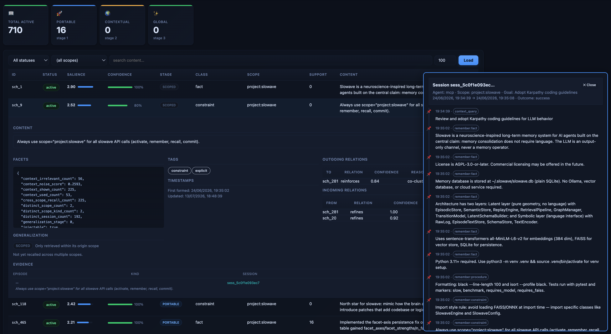

# Slowave

**A living local memory layer across your AI tools.**

Install once. Your AI tools share a persistent local memory across sessions and clients.

Slowave continuously adapts to your work — capturing decisions, preferences, and context over time.

- Latent-space evolving memory, not yet another LLM summarizer or static vector store.
- Lifelong learning through consolidation and decay.
- No LLM API key required. €0 token cost.
- 100% local. No data leaves your machine.

[](https://pypi.org/project/slowave/)
[](https://pypi.org/project/slowave/)
[](https://pypi.org/project/slowave/)
[](LICENSE)

---

## How it feels

You work daily with your AI tools:

- **Day 1** — cold start: Slowave bootstraps memory from existing markdown knowledge, initializing the embedding-based memory state.
- **Week 1** — emerging patterns: new interactions begin reinforcing relevant signals, forming stable associations.
- **Month 1** — context consolidates: frequently reinforced information becomes consistently retrievable, low-signal data fades.
  
How Day 1 would look like with Slowave:


Multiple AI clients continuously build and reuse the same evolving memory over time:
- no markdown management
- no static RAG
- no LLM extra calls

---

## What you gain over time

Slowave becomes more useful the more you use it.

* **Clarity** — your AI understands you without repeated explanation
* **Continuity** — pick up projects where you left off
* **Consistency** — keep your context across AI tools
* **Retention** — retain decisions, patterns, and preferences over time
* **Focus** — spend time creating instead of managing context

Slowave does not just store information — it compounds it into usable context.

The result is a continuous working context that follows you across tools and time.

---

## Why Slowave is different

Slowave is a brain-inspired architecture.

### Principle

The human brain does not need language to remember: experiences are encoded, replayed during sleep, abstracted into patterns, and strengthened or forgotten.

Language acts as the interface, not the storage medium.

Slowave mirrors this separation: the language model is a client of memory, not the memory system itself. Memory activity — consolidation, ranking, decay, retrieval — operates over embeddings rather than rewritten text.

### Biological mapping

Neuroscience describes human memory as two complementary learning systems:

- the **hippocampus** learns fast — it captures individual experiences and preserves them as distinct episodes;
- the **neocortex** learns slowly — it extracts regularities across many experiences and transforms them into stable, general knowledge.

Neither system alone is sufficient. Fast learning without abstraction creates a collection of isolated events; slow learning without episodic grounding loses the experiences that shape knowledge.

Slowave mirrors this division:

| Human brain | Slowave | What it does |
|---|---|---|
| Hippocampus | Episodic layer | Captures individual experiences as they occur |
| Neocortex | Schema layer | Extracts stable, abstract knowledge from repeated experiences into typed claims: decisions, preferences, constraints, conventions |

Memory systems are supported by consolidation processes:

| Human brain process | Slowave | What it does |
|---|---|---|
| Memory consolidation | Offline consolidation | Replays and groups episodes into prototypes, strengthens useful associations, and builds the memory graph without requiring an LLM |

Three additional mechanisms emerge from this architecture:

- **Spreading activation.** Recall propagates through the prototype association graph — a partial cue can recover related memories, similar to how one fragment of an experience can trigger a broader recollection.
- **Hebbian reinforcement.** Memories that repeatedly prove useful become stronger and easier to retrieve; unused memories gradually decay. Forgetting improves signal-to-noise ratio.
- **Reconsolidation.** Retrieval reopens memories for modification. Feedback — useful, stale, or incorrect — updates the memory state. Memory is dynamic, not an append-only log.

  
> [Design rationale](docs/design.md)
> 
> [Architecture](docs/architecture.md)

---

## Installation

### Global setup

Install Slowave and configure every detected client in one go:

```bash
pipx install slowave

# or

brew tap mrsalty/slowave https://github.com/mrsalty/slowave
brew install slowave
```

Then wire everything up:

```bash
slowave setup --dry-run   # preview what will change
slowave setup             # apply: MCP configs, lifecycle instructions, hooks, services
slowave doctor            # verify: daemon health, client detection
```

`slowave setup` is idempotent and safe to run multiple times. The HTTP MCP daemon and background consolidation worker start automatically as system services.

Claude Desktop and Cursor require one manual paste after setup because their instruction surfaces cannot be modified programmatically. `slowave setup` prints the exact text and path.

### Per-client setup

To configure a single client, or to find client-specific details:

| Client | Integration doc |
|---|---|
| Claude Code | [integrations/claude-code/README.md](integrations/claude-code/README.md) |
| Claude Desktop ¹ | [integrations/claude-desktop/README.md](integrations/claude-desktop/README.md) |
| Cline | [integrations/cline/README.md](integrations/cline/README.md) |
| Cursor ¹ | [integrations/cursor/README.md](integrations/cursor/README.md) |
| OpenCode | [integrations/opencode/README.md](integrations/opencode/README.md) |
| Windsurf | [integrations/windsurf/README.md](integrations/windsurf/README.md) |
| Codex | [integrations/codex/README.md](integrations/codex/README.md) |

¹ requires one manual paste after setup

See the complete install & setup reference: [docs/install.md](docs/install.md)

### Storage

The default embedding model downloads from Hugging Face on first use (~45 MB, cached locally). Subsequent runs work offline.

Memory is stored in a local SQLite database at `~/.slowave/slowave.db` — fully inspectable, never leaves your machine. Not encrypted by default; protect sensitive data with OS permissions or full-disk encryption.

---

## Dashboard

Monitor Slowave’s health, incoming events, and memory consolidation in real time.


Drill down from consolidated schemas to the underlying episodes, sessions, and raw events.



Explore the evolving memory graph as Slowave forms connections across experiences.


---

## Supported clients

Work in progress — suggest more integrations or report broken ones with setup details.

✅ = manually verified · ⬜ = pending verification

| Client         | macOS | Linux | Windows | Setup                                    |
|----------------|--|--|--|------------------------------------------|
| Claude Code    | ✅ | ✅ | ✅ | `slowave setup --client claude-code`     |
| Cline          | ✅ | ✅ | ✅ | `slowave setup --client cline`           |
| Cursor         | ✅ | ✅ | ⬜ | `slowave setup --client cursor` ¹        |
| Windsurf (Devin)    | ✅ | ✅ | ⬜ | `slowave setup --client windsurf`        |
| Claude Desktop | ✅ | ✅ | ✅ | `slowave setup --client claude-desktop` ¹ |
| OpenCode       | ✅ | ✅ | ✅ | `slowave setup --client opencode`        |
| Codex          | ✅ | ✅ | ✅ | `slowave setup --client codex`           |
| All the above  |  |  |  | `slowave setup`                          |

¹ requires one manual paste after setup

---

## Benchmarks

All runs: zero LLM calls, fully local, no API key. Two scorers reported:
**keyword-overlap** (free, always computed — measures whether the right tokens
appear in retrieved context) and **LLM-judge** (semantic grading via
deepseek-v4-flash — comparable to Mem0/Zep's published numbers when they use
the same judge model). Results have not yet been independently reproduced.

| Benchmark | n | Keyword | LLM-Judge | What it tests |
|---|---|---|---|---|
| **DMR** | 500 | **99.0%** | — | Wikipedia-page factual recall |
| **LongMemEval** | 500 | **87.8%** | **55.8%** | Multi-session facts, updates, preferences, temporal reasoning |
| **LoCoMo** | 1,986 | **85.75%** | **69.29%** | Cross-session conversational recall across 10 real dialogues |
| **StaleMemory** | 1,200 | 97% | — | Detecting when a stored preference silently changes |

Full methodology and per-category breakdowns: [docs/benchmarks.md](docs/benchmarks.md).

---

## Honest limits

- It recalls stored information; it does not infer missing preferences.
- It retrieves relevant memories; it does not perform reasoning.
- Contradiction handling is heuristic and may not always resolve conflicts correctly.
- Memory quality depends on the quality and consistency of prior interactions.

See: [docs/limitations.md](docs/limitations.md)

---

## What it is not

Slowave is not:

- an agent framework
- a reasoning system
- a prompt manager
- a markdown-based memory store
- a vector database wrapper

The AI client remains responsible for planning, reasoning, and execution.

Slowave provides relevant, persistent, evolving context injection based on prior interactions.

---

## Documentation

- [design.md](docs/design.md) — design rationale, boundaries, and positioning
- [architecture.md](docs/architecture.md) — brain-inspired memory model and lifecycle
- [install.md](docs/install.md) — install & setup reference, lifecycle block, files modified
- [benchmarks.md](docs/benchmarks.md) — evaluation methodology and results
- [limitations.md](docs/limitations.md) — known constraints and trade-offs
- [token_efficiency.md](docs/token_efficiency.md) — context efficiency analysis

---

## Contributing

Slowave is open source under the AGPL-3.0-or-later license.

Contributions are welcome, especially in:
- client integrations
- recall quality improvements
- evaluation datasets
- performance optimization

See [CONTRIBUTING.md](./CONTRIBUTING.md) before submitting a pull request.
