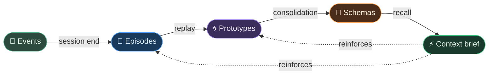

# 🧠 Slowave

**Brain-inspired, latent-space long-term memory for MCP-compatible AI agents, coding assistants, and chats.  
Shared across sessions, clients, and tools.**

[](https://pypi.org/project/slowave/)
[](https://pypi.org/project/slowave/)
[](LICENSE)

Slowave plugs into **Claude Code**, **Cline**, **Claude Desktop**, and more through MCP, giving them a shared local memory that accumulates, consolidates, adapts, and recalls across sessions.

Slowave is not just a transcript store or a conventional RAG layer. It is inspired by the idea that memory is a dynamic system shaped by association, time, salience, replay, and retrieval. The default memory path uses local embeddings, SQLite, FAISS, deterministic geometry, and background consolidation — without requiring an LLM call in the core memory loop.

> **Slowave core idea:** sessions create episodes, replay distills recurring patterns, time changes salience, contradiction-aware updates keep memory current, and recall reinforces memories that prove useful.

Most agent memory systems do one of two things: append your conversations to a Markdown file, or ask an LLM to rewrite your notes every turn. Both quietly accumulate stale text, forget context across sessions, or burn API calls on bookkeeping. Slowave does neither.

| What most systems do | What Slowave does instead |
|---|---|
| Append to a Markdown file or flat vector store | Form structured episodes from live events |
| Ask an LLM to summarise or rewrite memories | No LLM in the memory loop — ever |
| Return the same stale text on every query | Memories reinforce, decay, and reshape over time |
| Dump conversation history into the prompt | Inject a compact, cue-relevant brief via `slowave_context` |
| Start fresh every session | Cross-session memory that persists, consolidates, and evolves |
| Siloed to one tool | One shared memory store across all your AI clients |

## ✨ At a glance

| What you get | Why it matters |
|---|---|
| **No LLM in the core memory loop** | No API key, cloud extraction step, or per-query model call required. Memory ingest, consolidation, and retrieval are all LLM-free. |
| **Privacy-first local memory** | Memory is stored and processed locally; no cloud memory backend, API extraction step, or remote LLM inference is required. |
| **Local CPU inference** | Uses BAAI/bge-small-en-v1.5 embeddings, SQLite, FAISS, and deterministic geometry. |
| **Brain-inspired consolidation** | Raw events become episodes; episodes replay into prototypes; prototypes consolidate into latent schemas. |
| **Active recall** | Retrieved memories are reinforced, so recall changes the memory system over time. |
| **Time-aware memory** | Salience, decay, temporal anchors, supersession, and contradiction-aware updates help keep memory current. Episodes are date-stamped (ISO 8601) and recalled with temporal context. |
| **Gated working memory** | `slowave_context` injects a compact, cue-relevant brief instead of dumping history into the prompt. |



## ⚙️ How it works

1. You work with your AI client (Claude Code, Cline, Claude Desktop, or any MCP-compatible tool) on a task.
2. The client logs observations through MCP as the work happens.
3. When the session ends, Slowave forms an episode from those events.
4. The background worker consolidates episodes into prototypes and latent schemas.
5. In a future session, `slowave_context` injects a compact, cue-relevant memory brief.
6. Recalled memories are reinforced — shaping future retrieval.

Slowave can remember project conventions, architectural decisions, personal preferences, debugging lessons, open questions, constraints, and any context that should survive across sessions — for coding work and general chat alike.

## 🚀 Install

> **TL;DR — two commands and you're done:**
> ```bash
> pipx install slowave
> slowave setup
> ```
> `slowave setup` detects your platform, wires every client you have (Claude Code, Cline, Claude Desktop, and more as support expands), injects lifecycle instructions, and installs the background worker — all in one shot. It is idempotent: safe to re-run at any time.

---

### Step 1 — Install

Choose the method that fits your workflow:

```bash
# Recommended: pipx (isolated, no venv management)
pipx install slowave

# pip
pip install slowave

# macOS Homebrew (formula lives in the main repo)
brew tap mrsalty/slowave https://github.com/mrsalty/slowave
brew install slowave
```

<details>
<summary>Install from source</summary>

```bash
git clone https://github.com/mrsalty/slowave
cd slowave
python3 -m venv .venv
source .venv/bin/activate
pip install -e .
```

</details>

Installing gives you two binaries:

| Binary | Purpose |
|---|---|
| `slowave` | CLI, dashboard, manual recall, debugging, and research workflows. |
| `slowave-mcp` | MCP server used by Claude Desktop, Claude Code, Cline, and any MCP-compatible client. |

---

### Step 2 — Wire clients and start the worker

```bash
slowave setup
```

This single command handles everything:

| What it configures | Details |
|---|---|
| MCP config | Patches `~/.claude/settings.json`, Claude Desktop config, and Cline settings with the `slowave-mcp` server block |
| Lifecycle instructions | Injects the mandatory Slowave block into `~/.claude/CLAUDE.md` and `~/.clinerules` |
| Enforcement hooks | Adds `UserPromptSubmit` + `Stop` hooks in Claude Code so the model always calls Slowave |
| Background worker | Installs as a system service (launchd on macOS, systemd on Linux, Task Scheduler on Windows) |

Options: `--client [claude-code|claude-desktop|cline|all]` · `--no-worker` · `--no-hooks` · `--dry-run`

> [!IMPORTANT]
> MCP configuration alone is not enough — the client also needs the lifecycle instructions to reliably call Slowave tools. `slowave setup` handles both. See [docs/install.md](docs/install.md) for the full manual walkthrough and per-client integration guides in [integrations/](integrations/).

---

### Step 3 — Verify

```bash
slowave doctor   # checks Python, torch, faiss, and the embedding backend
slowave stats    # shows stored events, episodes, and schemas
```

Memory is stored locally at `~/.slowave/slowave.db`. No Ollama, OpenRouter, hosted vector database, or cloud service is required.

## 📊 Local dashboard

Run a read-only web UI for memory inspection:

```bash
slowave dashboard
# open http://127.0.0.1:8765
```

The dashboard binds to `127.0.0.1` by default and shows DB health, Slowave/MCP processes, schemas, a recall playground, and a schema graph.

## ⌨️ CLI usage

The CLI is useful for debugging, manual memory writes, dashboard access, and benchmark/research workflows. It should not be the first path for most users; real agent memory needs MCP plus prompt/rules injection.

See [docs/cli.md](docs/cli.md) for the command list and a CLI-only quickstart.

## 📚 Documentation

| Guide | Covers |
|---|---|
| [integrations/](integrations/) | Client-specific setup guides (Claude Desktop, Claude Code, Cline — more coming) |
| [docs/install.md](docs/install.md) | Full install and setup guide, `slowave setup` reference, manual wiring steps |
| [docs/architecture.md](docs/architecture.md) | Brain-inspired mechanisms, data flow, storage, recall, consolidation |
| [docs/design.md](docs/design.md) | Why the LLM path was removed from the memory loop |
| [docs/dashboard.md](docs/dashboard.md) | Local dashboard guide |
| [docs/cli.md](docs/cli.md) | CLI quickstart and command reference |
| [docs/benchmarks.md](docs/benchmarks.md) | Benchmark results, run conditions, per-category breakdown |
| [docs/limitations.md](docs/limitations.md) | Known limitations: schema quality, language support, scale |
| [docs/reproducibility.md](docs/reproducibility.md) | How to reproduce benchmark numbers |

## 📈 Benchmarks

> **Alpha-stage numbers.** Internal runs, not independently verified. Treat as directional. See [docs/benchmarks.md](docs/benchmarks.md) for full run conditions and known gaps.

**All runs: brain-only path, local CPU, BAAI/bge-small-en-v1.5 embeddings, SQLite + FAISS, zero LLM calls.**

Two modes are reported. The **with-consolidation** numbers (70.0% / 74.6%) represent the full Slowave pipeline: sessions → episodes → replay → latent schemas → recall. The **episode-only baseline** (60.2% / 74.6%) is retrieval without consolidation — episodes recalled directly, no schemas. The difference shows the contribution of the consolidation layer.

### Overall results

| Benchmark | Questions | With consolidation | Episode-only baseline | Cosine-only ablation¹ |
|---|---:|---:|---:|---:|
| LongMemEval | 500 | **70.0%** | 60.2% | ~60.0% |
| LoCoMo | 1 986 | **74.6%** | 74.6%² | ~68.0% |

*Metric: keyword hit-rate. All runs: zero LLM calls, ~10 ms recall latency, data on device.*

¹ Cosine-only ablation: spreading activation, graph expansion, and transition model all disabled.  
² LoCoMo is multi-session by design; episode retrieval already captures most of the signal and consolidation adds schemas on top of a strong baseline.

### Deep Memory Retrieval (DMR)

DMR (MemGPT paper) tests factual recall across multi-session persona conversations: 10 personas × 10 questions = 100 questions total. Published baselines from arXiv:2501.13956.

| System | Score | LLM calls | Cost |
|---|---:|---|---|
| **Slowave v0.1.8** | **95.0%** | **0** | **$0.00** |
| Zep (SOTA) | 94.8% | Many | $ |
| MemGPT baseline | 93.4% | Many | $ |

Slowave beats both published LLM-augmented baselines with zero API cost and ~9 ms recall latency.

### LongMemEval per-category (with consolidation)

| Category | Score | Notes |
|---|---:|---|
| Single-session-user | **91.4%** | ✅ strong |
| Knowledge-update | **92.3%** | ✅ strong |
| Single-session-assistant | **66.1%** | ✅ solid |
| Temporal-reasoning | **67.7%** | ✅ solid |
| Multi-session | 60.9% | ⚠ number aggregation gap |
| Single-session-preference | 20.0% | ⚠ preference abstraction gap |

### LoCoMo per-category (with consolidation)

| Category | Score | Notes |
|---|---:|---|
| Multi-session | **86.2%** | ✅ strong cross-session recall |
| Adversarial | **82.3%** | ✅ robust |
| Single-session | 64.9% | ✅ solid |
| Temporal | **56.1%** | ✅ solid |
| Commonsense | 27.1% | — world knowledge not in store |

### Known gaps

| Gap | Root cause | Status |
|---|---|---|
| Temporal date arithmetic | "How many days between X and Y?" requires arithmetic, not retrieval | Open — answer-construction layer |
| Multi-session aggregation (LME 60.9%) | Summing quantities across episodes — no single episode holds the answer | Open — explicit aggregation layer |
| Preference abstraction (LME 20%) | Implicit preferences not abstracted into queryable schema entries | Open — preference-extraction layer |

### Language support

**All core memory operations are language-agnostic** — episode storage, embedding, retrieval, FAISS search, salience, spreading activation, the prototype graph, and multi-scale consolidation work on embedding vectors and numeric metadata with no language dependency.

**Two components are English-only:**

| Component | English-only reason | Fallback for non-English |
|---|---|---|
| **Temporal anchor probe (Stage 10)** | Pre-embedded English landmark phrases ("last month", "two weeks ago") calibrate the temporal compass | Temporal re-ranking defaults to "now" — correct for atemporal queries, slightly suboptimal for past-anchored ones |
| **VSA dep-parse mode (`vsa_mode="ner"`)** | Uses spaCy `en_core_web_sm` dependency parser for subject/predicate/object role extraction | Use `vsa_mode="geometric"` (default, language-agnostic) or `vsa_mode="lexical"` (regex-based, no model dependency) |

The temporal probe phrase list is in `slowave/latent/temporal.py` (`_TEMPORAL_PROBES`). Adding phrases in other languages extends the compass to those languages without any other code change.

For a full language support matrix and multi-language deployment guide, see [docs/limitations.md](docs/limitations.md).

For full per-category results, run conditions, and known gaps see [docs/benchmarks.md](docs/benchmarks.md).  
For evaluation scripts and reproduction steps see [docs/reproducibility.md](docs/reproducibility.md).  
For known limitations see [docs/limitations.md](docs/limitations.md).

## ⚖️ License

Slowave is licensed under the **GNU Affero General Public License v3.0 or later** starting with version **0.1.5**.

Versions published before 0.1.5 were released under the MIT License; those earlier releases remain available under the terms they were originally published with.

This license keeps Slowave open for research, experimentation, and community use while ensuring that modified versions offered over a network make their source available under the same terms. Commercial licenses may be available for organizations that want to use Slowave in proprietary products, hosted services, or other contexts where AGPL compliance is not suitable. See [COMMERCIAL.md](COMMERCIAL.md).
