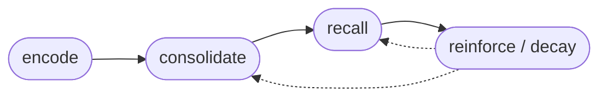

# Architecture

Slowave is a brain-inspired memory system.

This document describes the shape of the system and the ideas behind it — not its internals. It explains *what* the memory layers are, *why* they exist, and *how* they interact, at the level of the cognitive model Slowave is built on. Implementation details (algorithms, ranking formulas, data structures) are intentionally out of scope.

For the product rationale and positioning, see [design.md](design.md).

---

## The premise

The brain does not store memories the way a database stores rows.

It encodes experiences, replays them offline, abstracts recurring patterns into knowledge, strengthens what keeps proving useful, and lets the rest fade. Recalling a memory is itself an act that changes it.

Slowave takes this seriously as an architecture, not as a metaphor. Every mechanism in the system exists because it has a counterpart in how biological memory works. When a design decision must be made, the guiding question is: *what does the brain do here?*

The name comes from **slow-wave sleep** — the deep-sleep phase in which the brain replays the day's experiences and consolidates them into long-term knowledge. Consolidation in Slowave happens the same way: offline, in the background, without the "conscious" reasoning layer (the LLM) being involved.

---

## Two memory systems working together

Neuroscience describes human memory as two complementary learning systems:

- the **hippocampus** learns fast — it captures individual experiences in one shot, keeping them distinct;
- the **neocortex** learns slowly — it extracts the statistical regularities across many experiences into stable, general knowledge.

Neither system alone is enough. Fast learning without abstraction produces a pile of anecdotes; slow learning without an episodic buffer forgets everything that happened only once.

Slowave mirrors this division:

| Brain | Slowave | Role |
|---|---|---|
| Hippocampus | Episodic layer | Captures individual experiences (episodes) as they happen, with time, context, and salience |
| Sleep replay | Offline consolidation | Periodically replays episodes and groups related ones into recurring patterns (prototypes) |
| Neocortex | Semantic layer | Holds stable, abstracted knowledge (schemas): decisions, preferences, constraints, conventions |

New information enters fast at the episodic level and earns its way into the semantic level through repetition and use. Nothing is promoted by a language model deciding what matters — promotion is a consequence of observed experience.

---

## The memory lifecycle

### Encode

Experiences are captured as they happen, stamped with time, context, and an estimate of salience. Like the brain, Slowave does not record everything with equal weight — novelty and importance gate what is worth keeping.

### Consolidate

In the background, related episodes are replayed and compressed into more general structures. Isolated events become recurring patterns; recurring patterns become stable knowledge. This is the slow-wave sleep of the system: it runs offline, on a schedule, without any language model in the loop.

### Recall

Retrieval works by **spreading activation**: a cue (the current task) activates directly related memories, and activation spreads outward through associations to related knowledge. Partial cues are enough — like the brain, the system performs *pattern completion*, retrieving a whole from a fragment.

### Reinforce and decay

Memory strength is earned, not assigned. Memories that are recalled and prove useful become easier to retrieve — the software analogue of "neurons that fire together, wire together." Memories that sit unused gradually lose influence.

Forgetting here is a feature, not a bug. A memory system that never forgets drowns its own signal; decay is what keeps recall relevant.

### Revise

Recalling a memory reopens it. Feedback after retrieval can strengthen it, suppress it, mark it stale, or let newer knowledge supersede it — the analogue of *reconsolidation* in biological memory. Memory is a living state, not an append-only log.

---

## Context is part of memory

Human memory is context-dependent: what you remember depends on where you are and what you are doing.

Slowave models this with **scopes** (per project, domain, user, workflow). Memories form inside a context and are preferentially recalled inside that context — the analogue of *pattern separation*, which keeps similar-but-distinct experiences from interfering with each other.

But context is a soft boundary, not a wall. A memory that keeps proving useful across many different contexts gradually earns broader visibility, the way a lesson learned in one situation becomes general knowledge. Generalization is observed, not declared.

---

## Working memory

The brain does not bring all of long-term memory into awareness at once; a small, relevant subset is loaded into working memory for the task at hand.

Slowave does the same. At recall time it assembles a compact, ranked **working-memory brief** for the current task and injects only that into the agent's context. The full store stays outside the prompt.

---

## What the brain-inspired approach buys

Because memory operates on its own representations — embeddings, activation, associations, time — rather than on text manipulated by a language model:

- **No LLM in the memory loop.** Encoding, consolidation, recall, reinforcement, and decay run locally without model calls.
- **Local-first.** The entire memory substrate lives on-device (SQLite, local vector index, local embedding models).
- **Shared across tools.** Memory lives outside any single client, so every MCP-compatible tool reads and writes the same evolving store.
- **Explainable evolution.** Why a memory surfaced, strengthened, or faded is inspectable — it is the outcome of deterministic mechanisms, not of an opaque model rewrite.

---

## What this document leaves out

Deliberately: the consolidation algorithms, activation and ranking formulas, salience computation, decay schedules, and internal data structures. Those are the core of the project and evolve continuously; the architecture above is the stable contract.

---

## What Slowave is not

- A vector database with a mascot — retrieval is one mechanism among several, not the system.
- A chat history store — conversations are raw material, not memory.
- A cloud memory service — nothing leaves the machine.
- A RAG framework — Slowave feeds agents a working-memory brief, not document chunks.

It is an adaptive memory system: a small, local model of how a brain keeps what matters.
