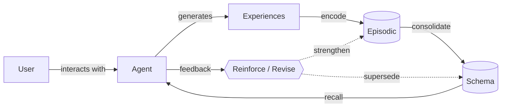

# Architecture

This document describes the cognitive architecture of Slowave — the memory layers, their lifecycle, and the brain model they are built on. It explains *what* the layers are, *why* they exist, and *how* they interact. Implementation details (algorithms, ranking formulas, data structures) are intentionally out of scope.

For the product rationale — why Slowave exists, what problems it solves, and where its boundaries are — see [design.md](design.md).

---

## The premise

The brain does not store memories the way a database stores rows.

It encodes experiences, replays them offline, abstracts recurring patterns into knowledge, strengthens what keeps proving useful, and lets the rest fade. Recalling a memory is itself an act that changes it.

Slowave takes this seriously as an architecture, not as a metaphor. Every mechanism in the system exists because it has a counterpart in how biological memory works. When a design decision must be made, the guiding question is: *what does the brain do here?*

The name comes from **slow-wave sleep** — the deep-sleep phase in which the brain replays the day's experiences and consolidates them into long-term knowledge. Consolidation in Slowave happens the same way: offline, in the background, without the "conscious" reasoning layer (the LLM) being involved.

---

## Two memory systems working together

Neuroscience describes human memory as two complementary learning systems:

- the **hippocampus** learns fast — it captures individual experiences in one shot, keeping them distinct;
- the **neocortex** learns slowly — it extracts the statistical regularities across many experiences into stable, general knowledge.

Neither system alone is enough. Fast learning without abstraction produces a pile of anecdotes; slow learning without an episodic buffer forgets everything that happened only once.

Slowave mirrors this division:

| Brain | Slowave | Role |
|---|---|---|
| Hippocampus | Episodic layer | Captures individual experiences (episodes) as they happen, with time, context, and salience |
| Sleep replay | Offline consolidation | Periodically replays episodes, groups related ones into prototypes, and builds a graph of associations between them |
| Neocortex | Schema layer | Holds stable, abstracted knowledge as typed claims: decisions, preferences, constraints, conventions — the layer the LLM reads |

New information enters fast at the episodic level and earns its way into the schema level through repetition and use. Nothing is promoted by a language model deciding what matters — promotion is a consequence of observed experience.

---

## The memory lifecycle

The lifecycle is a continuous loop through two memory stores — episodic (fast capture) and schema (stable knowledge) — with consolidation bridging them, recall feeding the agent, and feedback reshaping both.

### Encode

Experiences are captured as they happen, stamped with time, context, and an estimate of salience. Like the brain, Slowave does not record everything with equal weight — novelty and importance gate what is worth keeping. Each experience becomes an episode: an embedding vector carrying its temporal coordinate, scope, and initial salience.

### Consolidate

In the background, related episodes are replayed and compressed. Episodes cluster into **prototypes** — groups of related experiences represented as centroids. These prototypes form an **association graph** whose edges encode similarity, temporal transitions, and co-occurrence. The system also probes itself during consolidation — checking whether sibling memories are recoverable from their prototypes and learning from what it misses — a form of self-supervised rehearsal that needs no external signal.

From repeated prototypes, the system promotes stable patterns into **schemas**: typed text claims (facts, decisions, preferences, constraints) that form the layer the LLM reads. This is the slow-wave sleep of the system: offline, on a schedule, without any language model in the loop.

### Recall

Retrieval works by **spreading activation**: a query activates directly matching prototypes, and activation spreads outward through graph edges to related knowledge. Episodes are harvested from the activated prototypes and ranked, with schemas biasing the ranking toward their supporting evidence. Partial cues are enough — like the brain, the system performs *pattern completion*, recovering a whole from a fragment. The top results are compacted into a **working-memory brief** and injected into the agent's context.

### Reinforce and revise

Memory strength is earned, not assigned. Memories that are recalled and prove useful become easier to retrieve — the software analogue of "neurons that fire together, wire together." Memories that sit unused gradually lose influence. Forgetting is a feature: a memory system that never forgets drowns its own signal.

Feedback is multi-dimensional. A simple label — useful, stale, wrong, irrelevant — maps to a richer learning signal that distinguishes between distinct kinds of failure: the memory was factually incorrect, the memory was right but outdated, the memory matched the cue but didn't help the task, or the recall missed something entirely. These separate error channels drive different learning dynamics.

Recalling a memory reopens it. Feedback can strengthen the memory, suppress it, mark it stale, or let newer knowledge supersede it — the analogue of *reconsolidation* in biological memory. Supersession detects when a new fact replaces an old one (for example, "we use Python" → "we use Go") by recognizing the geometric direction of value substitution, without an LLM comparing the two statements. Memory is a living state, not an append-only log.

### The cognitive cycle

This lifecycle surfaces in the API as five verbs that structure every Slowave session: **activate** (prime working memory with a task cue), **remember** (encode a durable claim), **recall** (mid-task semantic lookup), **reinforce** (reward useful retrievals, penalize noise), and **commit** (close the session and trigger offline consolidation). Together they form a cognitive cycle — the same cycle an agent follows when it uses Slowave as its memory substrate.

---

## Context is part of memory

Human memory is context-dependent: what you remember depends on where you are and what you are doing. A fact learned in one setting may not surface in another unless it has been reinforced across contexts.

Slowave models this with **scopes** — labels like `project:slowave`, `domain:cooking`, or `workflow:releases` that tag every memory with its context of origin. Memories form inside a scope and are preferentially recalled inside that scope — the analogue of *pattern separation*, which keeps similar-but-distinct experiences from interfering with each other. A decision made in one project won't contaminate recall in another.

Context boundaries are soft, not hard walls. A memory that proves useful across many different scopes and scope kinds earns progressively broader visibility — but the bar is deliberate. The system requires evidence across separate sessions, not just repeated recall within one, so ephemeral patterns don't leak. Four stages govern this: **SCOPED** (default, within origin context), **PORTABLE** (across same scope kind), **CONTEXTUAL** (across all scopes with a recall penalty), and **GLOBAL** (everywhere, no penalty). At every stage, promotion is driven by observed evidence — never by a model classifying the memory as "general."

---

## Temporal context

Human memory does not store time as a separate metadata field. Every memory carries its temporal coordinate as an intrinsic part of the trace — recalling an event recalls *when* it happened as part of the same activation pattern.

Slowave encodes time the same way. Each memory carries a temporal embedding derived from its timestamp, and recall naturally favors memories whose temporal context is close to the query's anchor point. A question about "last month" activates a different temporal neighborhood than one about "right now," without any regex, date parser, or LLM call — the temporal signal lives in the same embedding space as the semantic content.

The brain analogue is hippocampal time cells and the lateral entorhinal cortex, which maintain a continuous temporal context vector. Slowave approximates this with a small, deterministic temporal encoding that requires zero training and zero external dependencies.

---

## Working memory

The brain does not bring all of long-term memory into awareness at once; a small, relevant subset is loaded into working memory for the task at hand. The rest stays latent — accessible but inactive.

Slowave does the same. At recall time it assembles a compact, ranked **working-memory brief** — only the most activated, highest-confidence schemas make the cut. A maximum item count and a total token budget prevent memory from crowding out the agent's reasoning space. Near-duplicates are collapsed; weakly activated memories are left out. The full store stays outside the prompt.

This is the bridge between Slowave's internal memory model and the agent's working context: selective injection, not wholesale replay.

---

## Architectural consequences

Building memory this way — on embeddings, activation, associations, and time rather than on text rewritten by a language model — produces several properties that are unusual in AI memory systems:

- **Pattern completion.** A partial cue is enough. Activate one related memory, and activation spreads through associations to recover the whole — the way a fragment of a song brings back the entire memory of where you heard it.
- **Pattern separation.** Similar-but-distinct experiences stay distinct. Scopes keep project-A decisions from contaminating project-B recall, the way the brain keeps similar episodes from collapsing into each other.
- **Reconsolidation.** Recalling a memory reopens it. Feedback after retrieval — useful, stale, wrong — changes the memory itself. Memory is a living state, not an append-only log.
- **Use-driven strength.** Memories that keep proving useful become easier to retrieve. Memories that sit unused gradually lose influence. Forgetting is a feature: it keeps the signal-to-noise ratio high as the store grows.
- **Homeostatic regulation.** As associations strengthen through repeated use, the graph would densify uncontrollably — the Hebbian runaway problem. A per-source normalization keeps total connection strength bounded, pruning the weakest edges. This is the direct analogue of synaptic scaling in biological networks.

---

## Architectural identity

Slowave is not a vector database with a mascot. Retrieval is one mechanism among several — the system is defined by how memories earn strength through use, how related experiences consolidate into stable knowledge, and how recall itself reshapes what is remembered.

It is an adaptive memory system: a small, local model of how a brain keeps what matters.

For a full statement of what Slowave is and is not at the product level, see the [Boundaries](design.md#boundaries) section of the design rationale.
