# Architecture

## Overview

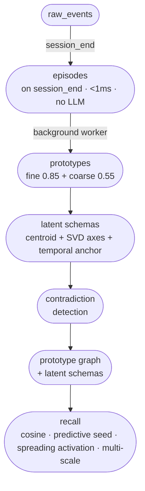

**Episodes** form immediately on session close — sub-millisecond, no LLM.  
**Prototypes** cluster episodes offline at two scales: fine (CA3-like, exact) and coarse (CA1-like, generalising).  
**Latent schemas** are a deterministic geometric fingerprint of a prototype: centroid + SVD principal axes + temporal anchor. No LLM extraction.  
**Recall** is always LLM-free: FAISS at both scales + predictive transition seed + spreading activation over the prototype graph + salience rerank.

---

## 1. Design Philosophy

Slowave is built on the observation that existing open-source agent memory systems (Mem0, Letta, Zep, A-MEM) update memory **on write only**: ingest a fact, deduplicate, store. Slowave additionally models the key operations of biological memory:

| Biological principle | Slowave implementation |
|---|---|
| Episodic encoding at experience time | Raw events → micro/macro episodes on session close |
| Slow-wave sleep consolidation | Replay engine runs offline (background worker) |
| Semantic abstraction over episodes | Two-scale prototype clustering: fine (CA3, 0.85) + coarse (CA1, 0.55) |
| Schema formation (neocortex) | **Latent schema**: centroid + SVD facet axes + temporal anchor — **zero LLM** |
| Predictive coding / surprise signal | Transition model predicts next episode embedding; surprise boosts salience |
| Ebbinghaus forgetting curve | Exponential salience decay between sessions |
| Memory reinforcement on use | Recall bumps salience of retrieved episodes/schemas; `recurrence_count` tracks recall hits |
| Schema utility scoring | `stability_score` (age + support), `recurrence_score` (recall hits), `schema_utility` (composite 0–1) wired into context gate and retrieval priors |
| Memory decay | `decay_unused`: idle schemas (never recalled, older than 30 days) lose salience; fall below threshold → `needs_review`; explicit-remember schemas are protected |
| Contradiction / belief revision | Geometric contradiction: centroid proximity + facet divergence + temporal ordering — **zero LLM** |
| Pattern completion | Spreading activation over prototype graph |
| Provenance chain | Every schema traces back through episodes to raw events |

### Zero LLM in the Core Path

**Slowave uses zero LLM calls during ingest, consolidation, or retrieval.** All memory operations happen in continuous embedding space using neuroscience-inspired mechanisms. This is the *only* supported path (Stages 1, 3, 6–9).

- $0 cost per query
- ~10ms recall latency
- On-device, no external APIs
- Deterministic geometry-based consolidation
- Benchmarks: LongMemEval 70.0% overall (temporal-reasoning 67.7%), LoCoMo temporal 56.1% (+39 pp vs pre-Stage-10)

The latent brain-only path is the only supported mode. LLM-based schema extraction was evaluated and removed.

The system is designed to generalise across agent types and benchmarks, not to overfit to any single evaluation.

### Known Limitations

**Language: English-only for temporal anchor estimation.**  
The temporal probe (Stage 10, `TemporalProbe`) estimates the time period a query refers to by measuring cosine similarity between the query embedding and a set of pre-embedded English temporal landmark phrases ("last month", "two weeks ago", "a long time ago", etc.). This works for any phrasing the underlying encoder has seen during training, but the probe phrases themselves are English, so the compass is calibrated for English queries only.

Queries in other languages will still use the sinusoidal temporal context system (Stage 7) — memories are retrieved and date-stamped correctly — but the backward temporal search (shifting the retrieval anchor toward the implied past moment) will not fire reliably for non-English temporal expressions. The fallback behaviour is identical to pre-Stage-10: the temporal bonus defaults to "now", which is correct for atemporal queries and slightly suboptimal for past-anchored ones.

To extend temporal anchor estimation to other languages, replace or augment `_TEMPORAL_PROBES` in `slowave/latent/temporal.py` with equivalent phrases in the target language. The architecture is language-agnostic beyond the probe phrase list.

**What is unaffected by this limitation:**  
- Episode storage, embedding, retrieval, and salience — all language-agnostic  
- Date stamping of retrieved episodes (`[YYYY-MM-DD]` prefix) — language-agnostic ISO 8601  
- Sinusoidal temporal context vectors (Stage 7) — purely numeric, no language dependency  
- Spreading activation, multi-scale retrieval, predictive seed — all language-agnostic  
- Latent schema building (geometric mode) — purely numeric, no language dependency

---

## 2. High-Level Architecture

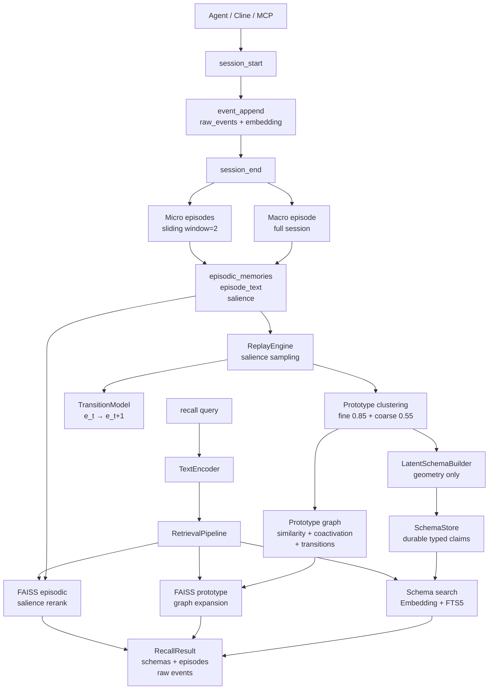

---

## 3. Memory Layers

Slowave has two distinct memory layers mirroring Complementary Learning Systems (CLS) theory.

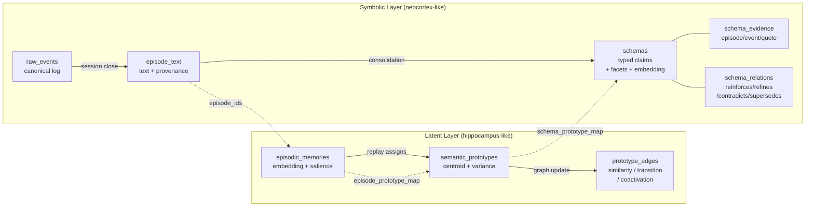

### Latent layer components

| Component | Role |
|---|---|
| `EpisodicStore` | Stores per-episode float32 embeddings as SQLite BLOBs; rebuilt into FAISS for ANN search |
| `SemanticStore` | Stores prototype centroids updated by online incremental mean during replay |
| `GraphManager` | Sparse directed graph over prototypes; edges carry similarity, transition probability, coactivation |
| `TransitionModel` | Small linear layer trained on consecutive episode pairs; provides prediction error / surprise signal |
| `SalienceEngine` | Novelty, exponential decay, recall reinforcement, consolidation penalty |
| `ReplayEngine` | Orchestrates all latent-layer operations on session close |

### Symbolic layer components

| Component | Role |
|---|---|
| `RawLog` | Append-only event log; source of truth for all provenance |
| `EpisodeTextStore` | Text representation of each episodic memory + source event IDs |
| `SchemaStore` | Durable typed claims with flexible facets, canonical embedding, salience, status, evidence |
| `LatentSchemaBuilder` | Centroid + SVD principal axes + temporal anchor + confidence |
| `GeometricContradictionJudge` | Geometric verdict: centroid proximity + facet divergence + temporal ordering |
| `Consolidator` | Orchestrates schema building (latent path) → SchemaStore |

---

## 4. Data Flow: Ingest

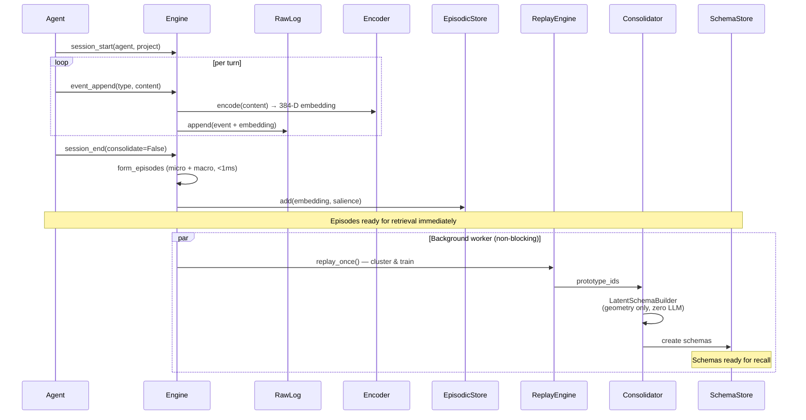

All operations are **geometry-based**, happening in continuous embedding space. No LLM calls anywhere.

---

## 5. Data Flow: Recall

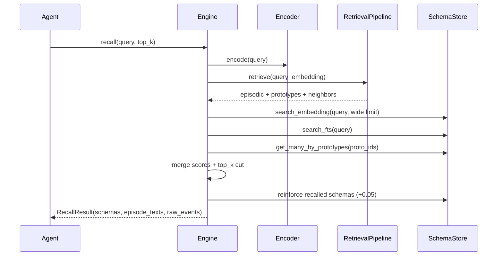

### Working-Memory Context Gate

`slowave_context` is not broad recall. It models the brain-like bottleneck
between long-term memory and active working context: many schemas may become
weakly activated by the current cue, but only a small, relevant, source-grounded
subset is admitted into the downstream agent/chatbot prompt.

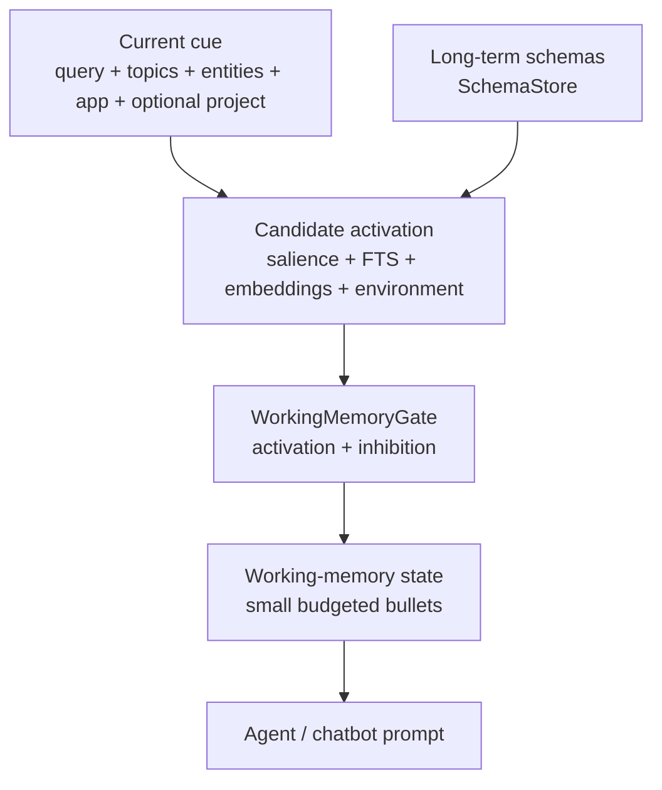

Brain mapping:

| Slowave mechanism | Brain-like analogue |
|---|---|
| cue/topic/entity overlap | context-dependent priming |
| schema salience/stability/source quality | neuromodulated importance + source monitoring |
| suppression of transcript/assistant summaries | inhibitory control / irrelevant-memory suppression |
| `project`/`application` | environmental/task-set cues, not hard namespaces |
| max items/chars | working-memory capacity limit |

Default context therefore prefers compact stable schemas such as preferences,
constraints, facts, decisions and lessons, while keeping raw episodes and noisy
assistant-generated summaries available through explicit recall/debug paths.

### RetrievalPipeline: Multi-Mechanism Ranking

The `RetrievalPipeline` combines four independent ranking signals to maximize both precision and recall:

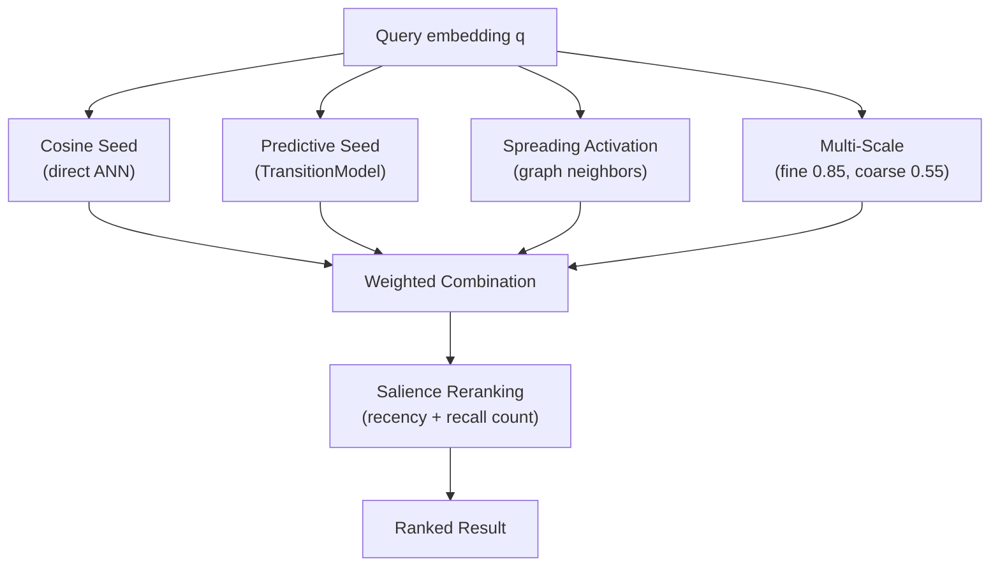

**Mechanism details:**

1. **Cosine Seed** (primary signal):
   - Compute cosine similarity between query and all episodic memories / prototypes
   - Top-k (typically 50–200) form the initial seed set
   - Weight: 0.65

2. **Predictive Seed** (TransitionModel):
   - If transition model exists and is trained: predict `q' = transition_model(q)`
   - Retrieve top-k neighbors of predicted `q'`
   - Rationale: helps recall sequences and predictable patterns
   - Weight: 0.25
   - Combined score: `0.65 × cosine(q) + 0.25 × cosine(q')`

3. **Spreading Activation** (see §8):
   - From cosine seed prototypes, activate neighbors via prototype graph
   - Traverse similarity, coactivation, and transition edges
   - Activation decays per hop: `0.7^depth`
   - Termination: depth ≥ 3 or activation < 0.05
   - Weight: 0.10

4. **Multi-Scale Filtering**:
   - Fine prototypes (threshold 0.85): high-precision clusters, ~5–15 members each
   - Coarse prototypes (threshold 0.55): high-recall generalizations, ~20–50 members each
   - Default behavior: return both fine and coarse results; clients can filter by `scale` attribute

**Final Reranking** (salience-aware):
```
final_score = ranking_score + 0.3 × salience_t
salience_t = salience × exp(-time_decay / tau)
```
where `tau = 3600s` (one hour) and `time_decay` is seconds since last recall.

This biases toward recently-used and frequently-recalled episodes without suppressing older knowledge.

---

## 6. Episode Formation

On `session_end`, raw events are converted to episodic memories using a multi-scale strategy that balances fine-grained context (micro) with holistic session summary (macro):

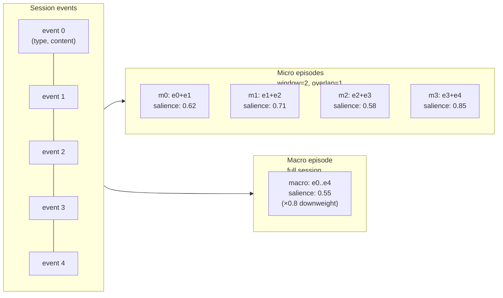

### Multi-Scale Episode Algorithm

**Input**: Session with N events, each with `type`, `content`, `embedding` (384-D), `timestamp`.

**Output**: 
- N−1 micro episodes (sliding window size 2, overlap 1)
- 1 macro episode (full session)
- Each episode stored in `episodic_memories` with embedding, salience, metadata

**Micro Episode Creation** (for each i ∈ [0, N−2]):
```
embedding_micro[i] = (embedding[i] + embedding[i+1]) / 2
timestamp_micro[i] = timestamp[i+1]  (use end timestamp)
metadata_micro[i] = {
  event_ids: [i, i+1],
  event_types: [type[i], type[i+1]],
  is_remember: type[i]=="remember" OR type[i+1]=="remember"
}
```

**Macro Episode Creation** (once per session):
```
embedding_macro = mean(embedding[0..N-1])  (unweighted average)
timestamp_macro = timestamp[N-1]  (use session end time)
metadata_macro = {
  event_ids: [0..N-1],
  event_types: [type[0..N-1]],
  is_remember: any(type == "remember")
}
salience_macro_multiplier = 0.8  (downweight global summary)
```

**Salience Computation** (per episode, before storage):

```
novelty = 1.0 - max(0, max_cosine_sim)
where max_cosine_sim = max over existing episodic_memories of cosine(embedding, existing.embedding)

# If transition model is trained:
surprise_weight = ||transition_model(embedding_prev) - embedding_curr||^2
surprise_normalized = clamp(surprise_weight / percentile_90_past_errors, 0, 1)
else:
surprise_normalized = 0.0

base_salience = novelty + 0.3 * surprise_normalized

# Apply modifiers:
if is_remember:
  salience = base_salience + 0.6  (explicit memory bonus)
else if episode_type == "macro":
  salience = base_salience * 0.8  (downweight global)
else:
  salience = base_salience

# Floor and ceiling:
salience = clamp(salience, 0.01, 1.0)
```

**Edge Cases**:
- Session with 0–1 events: no micro episodes, macro only (if N ≥ 1)
- Session with repeated identical embeddings: novelty = 0.0, base_salience may be very low (OK, replay will discard)
- No existing episodic memories: novelty = 1.0 (all new episodes get high initial salience)

---

## 7. TransitionModel: Predictive Coding for Salience & Retrieval

The transition model predicts the next episode embedding from the current one, enabling two key mechanisms:
1. **Surprise Signal**: Prediction error boosts salience of unexpected episodes
2. **Predictive Seed**: Predicted embeddings seed additional recall candidates

### Architecture

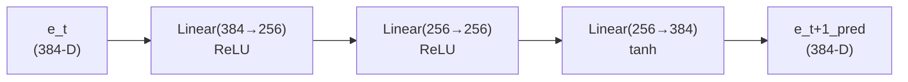

**Model Parameters**:
- Input: 384-D episode embedding (from `BAAI/bge-small-en-v1.5`)
- Hidden layers: 256-D with ReLU activations
- Output: 384-D predicted embedding (tanh activation for bounded output)
- Total parameters: ~300k

**Loss Function**:
```
L = MSE(e_{t+1}_pred, e_{t+1}_true)
  = mean((e_{t+1}_pred - e_{t+1}_true)^2)
```

### Training Protocol

The transition model trains during `ReplayEngine.replay_once()` on consecutive episode pairs:

**Batch Formation**:
```
For each replay cycle:
  - Sample up to `sample_size` episodes (default 256, weighted by salience)
  - For each sampled episode[i], if i+1 exists in episodic_memories:
    - Create training pair (embedding[i], embedding[i+1])
  - Batch size ≈ 0.8 * sample_size (some sampled episodes are terminal)
```

**Training Loop**:
```
optimizer = Adam(lr=1e-3, weight_decay=1e-5)
for epoch in range(5):  # fixed 5 epochs per replay
  shuffled_pairs = shuffle(training_pairs)
  for batch in batches(shuffled_pairs, size=32):
    e_t_batch, e_t1_batch = batch
    e_t1_pred = transition_model(e_t_batch)
    loss = MSE(e_t1_pred, e_t1_batch)
    loss.backward()
    optimizer.step()
    optimizer.zero_grad()
```

**No Early Stopping**: The model trains for fixed epochs without validation loss check. This keeps consolidation non-blocking but means overfitting is possible if `sample_size` is very small or episodes are bursty.

### Surprise Signal Computation

After training, on each episode's salience update:

```
# Forward pass (no grad):
e_next_pred = transition_model(embedding_current)

# Prediction error (L2 distance):
prediction_error = ||e_next_pred - embedding_next||^2

# Normalize against recent history (rolling percentile):
baseline = percentile(past_100_errors, 10)  # 10th percentile
surprise_signal = max(0, prediction_error - baseline)
surprise_normalized = min(1.0, surprise_signal / percentile_90)

# Apply to salience (see §6, Episode Formation):
salience_adjusted = base_salience + 0.3 * surprise_normalized
```

**Intuition**: Episodes that violate the learned sequence pattern get higher salience, making them more likely to be replayed and consolidated into schemas.

### Predictive Seed for Recall

During retrieval (see §5.5), if transition model is trained:

```
q = query_embedding
q_pred = transition_model(q)  # predict next expected state

# Retrieve neighbors of both:
results_cosine = faiss_episodic.search(q, k=50)
results_predictive = faiss_episodic.search(q_pred, k=50)

# Combine scores (see §5.5):
combined_score = 0.65 * score_cosine + 0.25 * score_predictive + 0.10 * spreading_activation
```

This helps recall episodes that follow a predictable sequence (e.g., in a multi-turn conversation, recall the agent's likely next response).

---

## 8. Spreading Activation: Pattern Completion Over Prototype Graph

Spreading activation implements memory association across the prototype graph, biasing retrieval toward related concepts.

### Graph Structure

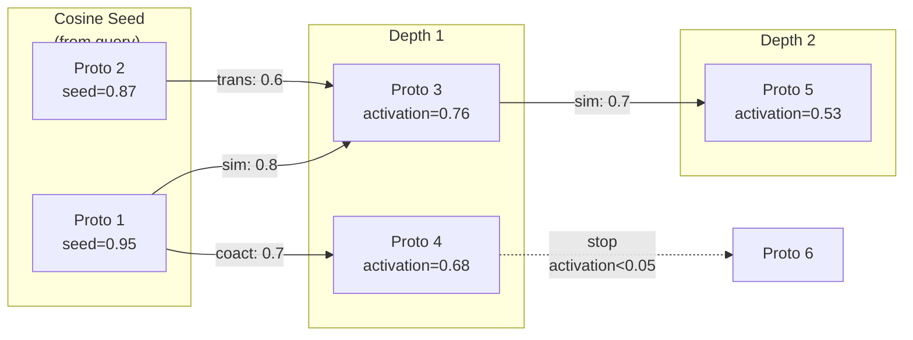

**Edge Types** (stored in `prototype_edges` table):
- **Similarity** (`edge_type='similarity'`): high cosine sim between centroids
- **Coactivation** (`edge_type='coactivation'`): episodes recalled together historically
- **Transition** (`edge_type='transition'`): episodes appear in sequence (from transition model)

### Activation Algorithm

```
def spread_activation(seed_prototypes, query_embedding):
  activation = {proto_id: seed_score for proto_id, seed_score in seed_prototypes}
  queue = priority_queue(seed_prototypes, descending by score)
  visited = set(seed_prototypes.keys())
  depth_map = {proto_id: 0 for proto_id in seed_prototypes}
  
  while queue not empty:
    current_proto_id, current_activation = queue.pop()
    current_depth = depth_map[current_proto_id]
    
    # Termination conditions:
    if current_activation < 0.05 or current_depth >= 3:
      continue
    
    # Traverse outgoing edges:
    for neighbor_proto_id, edge_weight in graph[current_proto_id]:
      if neighbor_proto_id in visited:
        continue
      
      # Decay activation per hop:
      neighbor_activation = current_activation * edge_weight * (0.7 ^ current_depth)
      
      if neighbor_activation > 0.05:  # only add if above threshold
        activation[neighbor_proto_id] = max(
          activation.get(neighbor_proto_id, 0),
          neighbor_activation
        )
        depth_map[neighbor_proto_id] = current_depth + 1
        queue.push(neighbor_proto_id, neighbor_activation)
        visited.add(neighbor_proto_id)
  
  return activation
```

### Integration with Retrieval

During `RetrievalPipeline.retrieve()` (see §5.5):

```
# Step 1: Cosine seed (top-k prototypes)
cosine_scores = faiss_semantic.search(query_embedding, k=50)

# Step 2: Spread activation from cosine seed
spreading_activation_scores = spread_activation(
  seed_prototypes=dict(cosine_scores),
  query_embedding=query_embedding
)

# Step 3: Combine (weight 0.10 for spreading activation)
final_proto_scores = {}
for proto_id in union(cosine_scores, spreading_activation_scores):
  final_proto_scores[proto_id] = (
    0.65 * cosine_scores.get(proto_id, 0) +
    0.25 * predictive_scores.get(proto_id, 0) +  # if transition model exists
    0.10 * spreading_activation_scores.get(proto_id, 0)
  )

# Step 4: Retrieve episodes from top prototypes
episodes = {}
for proto_id in top_k(final_proto_scores, k=20):
  episodes.update(episodic.by_prototype(proto_id))
```

**Impact**: Spreading activation is particularly effective for multi-hop queries (e.g., "tools I've used for data analysis" → recalls SQL + Python + Jupyter even if none appear in query).

---

## 9. Schema Structure

A schema is a durable typed claim about the user or project, consolidated from episodic evidence.

```
Schema {
  content_text             str     ← human-readable claim
  facets {
    schema_class           str     ← fact | preference | habit | decision | constraint | ...
    scope                  str     ← domain/context
    polarity               str     ← positive | negative | neutral | mixed
    stability              str     ← one_off | recurring | current | historical
    positive               [str]   ← what to prioritise in future responses
    negative               [str]   ← what to avoid
    entities               [str]   ← salient named entities
    attributes             {str}   ← structured slots
  }
  tags                     [str]   ← compact search tags
  confidence               float   ← extractor confidence [0, 1]
  salience                 float   ← decays, reinforced on recall
  status                   str     ← active | needs_review | superseded | contradicted | archived
  embedding                blob    ← canonical schema text embedding (claim + facets + tags)
  schema_evidence          [...]   ← {episode_id, raw_event_id, quote, weight}
  schema_relations         [...]   ← {src, dst, relation, confidence, reason}
}
```

### Schema relations

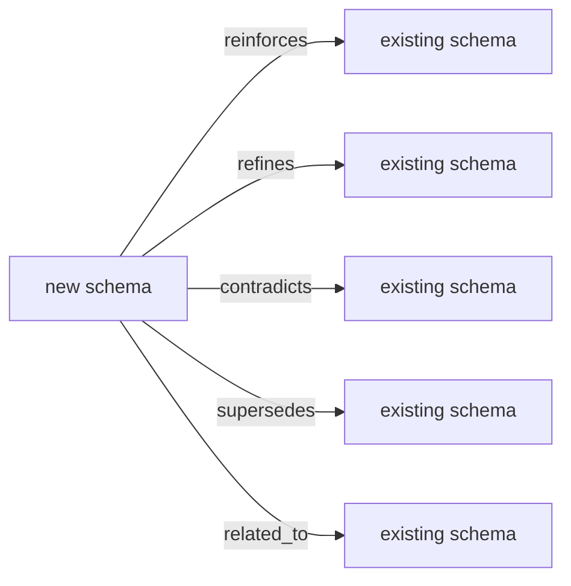

### Canonical schema embedding

Schemas are embedded using **canonical schema text** — claim + facets + tags — so the embedding captures structured memory content, not only surface wording:

```
Claim: For running training advice, the user prefers plans adapted to their knee injury.
Class: preference
Scope: running training advice
Positive: knee-adapted plans, gradual mileage increases
Negative: generic high-mileage programmes
Entities: knee injury
Tags: running, training, injury, adaptation
```

---

## 10. Salience Dynamics

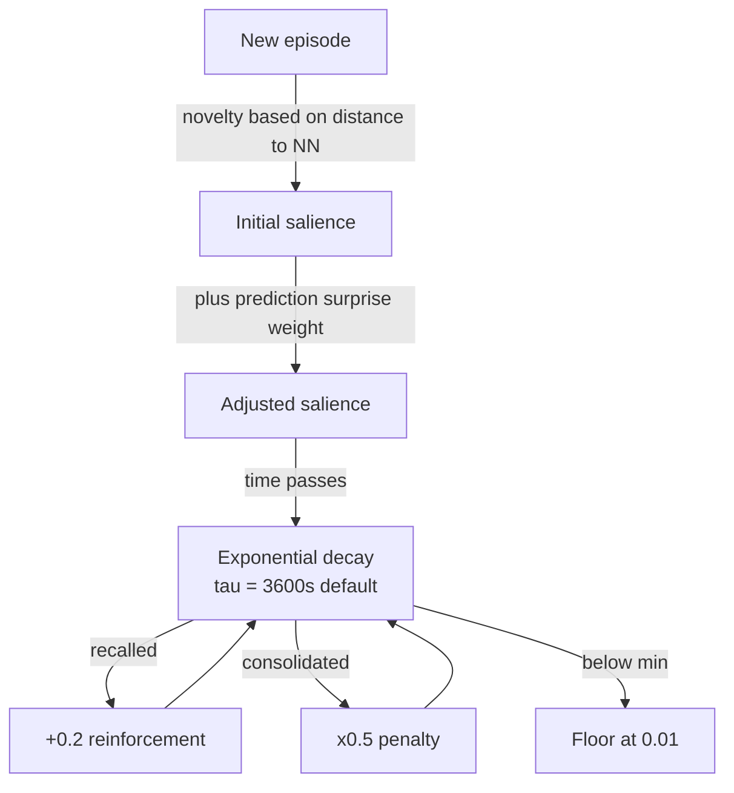

Salience governs replay sampling (proportional), retrieval reranking (`cosine + 0.3×salience`), and schema persistence (superseded schemas drop to `0.05`).

---

## 11. Consolidation Pipeline: Prototype Clustering & Latent Schema Formation

Consolidation is the offline background process that transforms episodic memories into semantic knowledge (prototypes and schemas) **using pure geometry — zero LLM**. It is decoupled from ingest: agents never wait for consolidation to complete.

### Consolidation Lifecycle

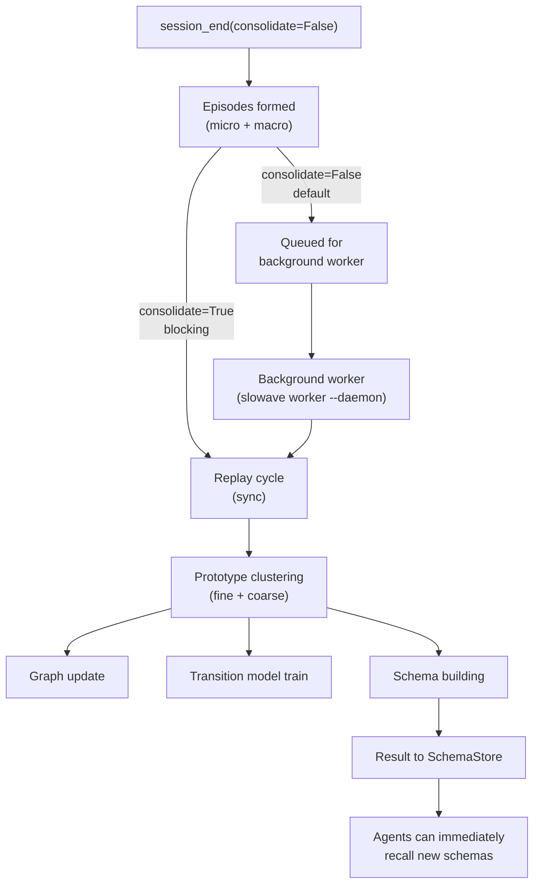

**Recommendation**: Use `consolidate=False` (the default) for agent sessions. Episodes are available for recall immediately; schemas become available seconds to minutes later via the background worker.

### Multi-Scale Prototype Clustering

During `ReplayEngine.replay_once()`, episodes are assigned to prototypes using cosine similarity with two thresholds:

```
def cluster_episodes_multiscale(sampled_episodes, existing_prototypes):
  assignments_fine = {}      # threshold = 0.85 (CA3-like)
  assignments_coarse = {}    # threshold = 0.55 (CA1-like)
  new_prototypes = []
  
  for episode in sampled_episodes:
    assigned_fine = False
    assigned_coarse = False
    
    # Try assignment to existing prototypes (both scales):
    for prototype in existing_prototypes:
      sim = cosine_similarity(episode.embedding, prototype.centroid)
      
      if sim >= 0.85:
        assignments_fine[prototype.id].append(episode.id)
        assigned_fine = True
      
      if sim >= 0.55:
        assignments_coarse[prototype.id].append(episode.id)
        assigned_coarse = True
    
    # If no assignment at fine scale, create new fine prototype:
    if not assigned_fine:
      new_proto = create_prototype(centroid=episode.embedding, scale='fine')
      assignments_fine[new_proto.id] = [episode.id]
      new_prototypes.append(new_proto)
    
    # If no assignment at coarse scale, create new coarse prototype:
    if not assigned_coarse:
      new_proto = create_prototype(centroid=episode.embedding, scale='coarse')
      assignments_coarse[new_proto.id] = [episode.id]
      new_prototypes.append(new_proto)
  
  return assignments_fine, assignments_coarse, new_prototypes
```

**Threshold Semantics**:

| Scale | Threshold | Brain analogue | Episodes per prototype | Use case |
|---|---|---|---|---|
| **Fine** | 0.85 (high cosine sim) | CA3 (exact memory) | ~5–15 | Precision retrieval; exact concept matches |
| **Coarse** | 0.55 (moderate cosine sim) | CA1 (pattern completion) | ~20–50 | High-recall retrieval; related concepts |

**Multi-Scale Behavior**:
- If episode matches both fine and coarse thresholds, it belongs to **both** prototypes (redundancy for robustness)
- Fine prototypes are tight clusters; coarse are looser generalizations
- Schemas are built independently for each scale; clients can filter by `scale` attribute during retrieval

**Motivation**: Fine thresholds give exact recall (high precision); coarse thresholds give broader pattern matching (high recall). Using both allows a single query to retrieve both precise matches and related concepts.

### Graph Update & Edge Weighting

After clustering, the `GraphManager` updates prototype edges:

```
def update_prototype_graph(assignments_fine, transition_model):
  # Similarity edges (cluster structure):
  for proto_id in assignments_fine:
    prototype = get_prototype(proto_id)
    members = [ep.embedding for ep in episodes[proto_id]]
    centroid = prototype.centroid
    for member in members:
      sim = cosine(member, centroid)
      # High-sim members reinforce prototype cohesion
  
  # Coactivation edges (retrieval history):
  for (proto_a, proto_b) in co_recalled_pairs:
    coactivation_count = count_joint_recalls(proto_a, proto_b)
    edge_weight = coactivation_count / total_recalls
    add_or_update_edge(proto_a, proto_b, type='coactivation', weight=edge_weight)
  
  # Transition edges (sequential patterns):
  for (episode_a, episode_b) in consecutive_pairs:
    if transition_model exists:
      pred_b = transition_model(episode_a.embedding)
      transition_sim = cosine(pred_b, episode_b.embedding)
      # High transition sim indicates predictable sequence
      proto_a = episode_a.prototype
      proto_b = episode_b.prototype
      add_or_update_edge(proto_a, proto_b, type='transition', weight=transition_sim)
```

---

### Default Path: Latent Schema Building

For each prototype, `LatentSchemaBuilder` creates a schema purely from geometry—no LLM.

#### VSA Role Binding (Stage 11)

Every latent schema is also encoded as a **Vector Symbolic Architecture (VSA)** triple — a
single 384-D vector that binds three semantic roles (subject / predicate / object) using
Holographic Reduced Representations (HRR).  The binding uses circular convolution, which
is O(d log d) via FFT and produces a vector nearly orthogonal to both inputs.  The triple
is stored as a base64 blob in `facets_json["vsa_vec"]`.

Three role-extraction modes are available via `LatentSchemaBuilder(vsa_mode=...)`:

| Mode | How roles are extracted | Language | Encoder call? |
|---|---|---|---|
| `"geometric"` (default) | centroid → subject, PCA axis 1 → predicate, PCA axis 2 → object | language-agnostic | No |
| `"lexical"` | regex verb detector + lexical signature | English-optimised | Yes (once per schema) |
| `"ner"` | spaCy dep-parse (en_core_web_sm) | **English-only** | Yes (once per schema) |

> **Language note:** `vsa_mode="ner"` uses spaCy's `en_core_web_sm` dependency parser.
> Despite the name, Named-Entity Recognition is *disabled*; only the dependency parse
> (tok2vec, tagger, parser) is used.  This mode is **English-only**.
> For non-English deployments, use `vsa_mode="geometric"` (default, language-agnostic).
> See [docs/limitations.md](limitations.md) for the full language support matrix.

The VSA vector is stored per-schema and can be used for associative role-based retrieval
(e.g. "find schemas where the subject is close to embedding X").

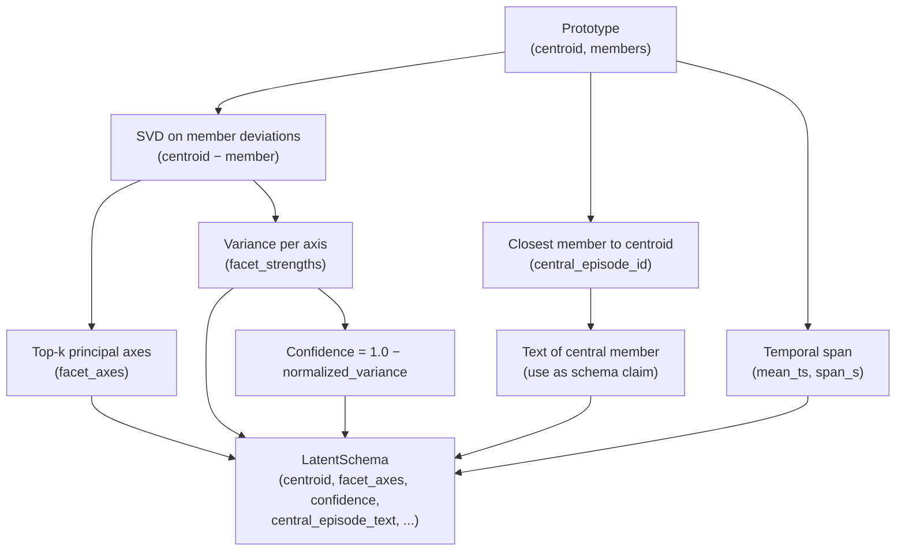

**Schema Formation Algorithm**:

```
def build_latent_schema(prototype):
  # Get member episodes:
  member_episodes = episodic.by_prototype(prototype.id)
  if not member_episodes:
    return None
  
  # Compute member deviations from centroid:
  member_embeddings = [ep.embedding for ep in member_episodes]
  deviations = [emb - prototype.centroid for emb in member_embeddings]
  
  # SVD for principal axes:
  U, S, Vt = svd(np.stack(deviations, axis=0), full_matrices=False)
  k = 3  # top-3 axes
  facet_axes = Vt[:k, :]  # top k principal directions (in embedding space)
  facet_strengths = (S[:k] ** 2) / (S ** 2).sum()  # normalized variance per axis
  
  # Confidence: tightness of cluster:
  within_cluster_variance = (S[k:] ** 2).sum() / (S ** 2).sum()
  confidence = 1.0 - within_cluster_variance
  
  # Central episode (closest to centroid):
  central_idx = argmin([cosine_distance(emb, prototype.centroid) for emb in member_embeddings])
  central_episode = member_episodes[central_idx]
  central_text = episode_text.get(central_episode.id).content_text
  
  # Temporal:
  timestamps = [ep.ts for ep in member_episodes]
  mean_ts = int(np.mean(timestamps))
  ts_span = max(timestamps) - min(timestamps)
  
  # Build schema object (no LLM):
  schema = LatentSchema(
    centroid=prototype.centroid,
    facet_axes=facet_axes,
    facet_strengths=facet_strengths,
    member_episode_ids=[ep.id for ep in member_episodes],
    central_episode_id=central_episode.id,
    central_episode_text=central_text,  # ← used as claim
    mean_ts=mean_ts,
    ts_span_s=ts_span,
    confidence=confidence,
    support_count=len(member_episodes),
    tags=[],  # optional, can be derived from central_episode
  )
  
  return schema
```

**Schema Interpretation**:
- `central_episode_text` becomes the human-readable claim ("For running advice, user prefers knee-adapted plans")
- `facet_axes` capture what varies within the schema's examples (e.g., which dimensions of the embedding space vary most)
- `confidence` high when all members are similar (tight cluster); low when members are diverse
- `support_count` is the number of episodes backing the schema

### Geometric Contradiction Detection

When a new schema is formed, `GeometricContradictionJudge` compares it against existing schemas to detect contradictions, refinements, and reinforcements:

```
def judge_contradiction(new_schema, existing_schemas):
  for existing in existing_schemas:
    # 1. Centroid proximity (same topic?):
    centroid_sim = cosine(new_schema.centroid, existing.centroid)
    
    if centroid_sim > 0.75:
      # Same topic; check facets:
      
      # 2. Facet divergence (different aspect?):
      facet_distance = angle_between_principal_subspaces(
        new_schema.facet_axes, existing.facet_axes
      )  # degrees in subspace
      
      if facet_distance > 45:
        verdict = "refines"  # different aspect of same topic
      else:
        verdict = "reinforces"  # same aspect, likely same content
      
      # 3. Temporal ordering (which is fresher?):
      time_delta = new_schema.mean_ts - existing.mean_ts
      
      if time_delta > 0 and new_schema.confidence > existing.confidence:
        # New schema is fresher and more confident:
        if centroid_sim > 0.90 and facet_distance < 30:
          verdict = "contradicts"  # same topic, same facets, newer
        elif new_schema.confidence > 0.8:
          verdict = "supersedes"  # new schema is very confident
      
      reasoning = f"centroid_sim={centroid_sim:.2f}, facet_distance={facet_distance:.1f}°, time_delta={time_delta}s"
      
      return GeometricVerdict(
        verdict=verdict,
        reasoning=reasoning,
        similarity=centroid_sim,
        facet_distance=facet_distance,
        time_delta_s=time_delta
      )
    
    else:
      # Centroid sim < 0.75: unrelated topics
      return GeometricVerdict(verdict="unrelated", ...)
  
  # No existing schema similar enough:
  return None
```

**Verdict Types**:
- **`reinforces`**: new schema has same topic and facets; adds evidence to existing
- **`refines`**: new schema has same topic but different facets; captures new aspect
- **`contradicts`**: new schema has same topic/facets but contradicts existing (use newer)
- **`supersedes`**: new schema is very confident and contradictory; mark existing as superseded
- **`unrelated`**: no similarity; create new independent schema

---

## 12. Storage Layout

All data lives in a single **SQLite** file (WAL mode). Embeddings are stored as `BLOB` columns and loaded into **in-memory FAISS** indices on engine start.

```
slowave.db
├── latent layer
│   ├── episodic_memories        embedding + salience + metadata
│   ├── semantic_prototypes      centroid + variance + support_count
│   ├── episode_prototype_map    M:1 episode → prototype
│   └── prototype_edges          similarity / coactivation / transition weights
├── symbolic layer
│   ├── sessions
│   ├── raw_events               canonical event log + optional embedding
│   ├── episode_text             text + event provenance
│   ├── schemas                  claims + facets + canonical embedding + status
│   ├── schema_evidence          episode/event/quote links
│   ├── schema_prototype_map     M:M schema ↔ prototype
│   └── schema_relations         schema graph edges
└── FTS5 indices
    ├── schemas_fts
    ├── episodes_fts
    └── raw_events_fts
```

---

## 13. Integrations

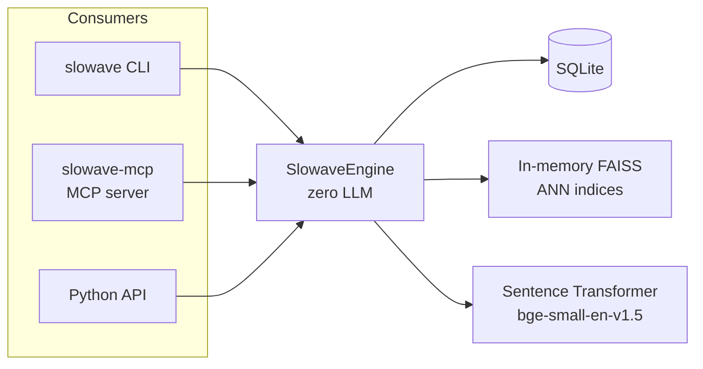

**All operations are on-device, zero external APIs.**

MCP tools: `slowave_session_start`, `slowave_event`, `slowave_session_end`, `slowave_recall`, `slowave_remember`, `slowave_context`, `slowave_stats`.

---

## 14. Key Configuration

```python
SlowaveConfig(
    db_path               = "~/.slowave/slowave.db",
    dim                   = 384,
    encoder               = EncoderConfig(model="BAAI/bge-small-en-v1.5"),
    salience              = SalienceConfig(
        tau_seconds             = 3600.0,        # forgetting curve decay
        recall_reinforcement    = 0.2,           # +salience on recall
        consolidation_penalty   = 0.5,           # ×0.5 on consolidation
    ),
    replay                = ReplayConfig(
        sample_size             = 256,           # episodes per replay cycle
        max_prototypes_per_replay = 32,          # prototypes per cycle
        assignment_threshold    = 0.65,          # fine-scale clustering
    ),
)
```

**No LLM needed.** All schema building uses `LatentSchemaBuilder` (pure geometry, zero LLM calls).

---

## 15. Module Map

```
slowave/
├── core/
│   ├── config.py           SlowaveConfig
│   ├── engine.py           SlowaveEngine (public façade)
│   └── consolidation.py    Consolidator
├── latent/
│   ├── episodic_store.py
│   ├── semantic_store.py
│   ├── graph_manager.py
│   ├── replay_engine.py
│   ├── retrieval.py
│   ├── salience.py
│   ├── schema.py           LatentSchemaBuilder + LatentSchema + GeometricContradictionJudge
│   ├── transition_model.py
│   ├── types.py
│   └── vsa.py              VSA role binding (HRR, bind/unbind/bundle, geometric/lexical/dep-parse)
├── symbolic/
│   ├── raw_log.py
│   ├── episode_text.py
│   ├── schema_store.py     SchemaStore + canonical_schema_text()
│   └── encoder.py
├── storage/
│   ├── sqlite_db.py
│   └── schema.sql
├── cli/main.py
└── mcp/server.py
```

---

## 16. Biological Analogies

| Slowave component | Biological analogue |
|---|---|
| `raw_events` | Sensory input / working memory |
| `episodic_memories` | Hippocampal episodic traces |
| `semantic_prototypes` | Cortical category representations |
| `prototype_edges` | Associative cortical connectivity |
| `transition_model` | Predictive coding / sequence learning |
| Replay engine | Slow-wave sleep / hippocampal sharp-wave ripples |
| `schemas` | Neocortical long-term semantic knowledge |
| VSA role binding (`vsa.py`) | Hippocampal binding — superposition of who/what/where/when |
| Salience decay | Forgetting curve (Ebbinghaus) |
| Recall reinforcement | Memory reconsolidation / use-dependent strengthening |
| Contradiction judge | Belief revision / predictive error correction |
| Evidence provenance | Episodic trace back to sensory context |

---

## 17. Error Recovery & Resilience

Slowave is designed to recover gracefully from transient errors and corruption. This section documents failure modes and recovery procedures.

### SQLite Corruption

**Symptoms**: "database disk image malformed" or random `NULL` values in retrieval results.

**Recovery**:
```bash
# Attempt recovery via SQLite's built-in recovery tool:
sqlite3 ~/.slowave/slowave.db ".recover" > slowave.recover.sql

# Create a fresh DB and restore:
sqlite3 ~/.slowave/slowave.db.recovered < slowave.recover.sql

# Verify integrity:
sqlite3 ~/.slowave/slowave.db.recovered "PRAGMA integrity_check;"
```

Then restart slowave; it will auto-rebuild FAISS indices from the recovered database.

**Prevention**:
- Use WAL mode (default) for better crash resistance
- Run `PRAGMA optimize` periodically on long-running servers
- Monitor disk space; stop writes if disk is full

### FAISS Index Divergence

**Symptoms**: Retrieval returns unexpected results; same query gives different results on re-run; FAISS internal assertion errors.

**Root cause**: FAISS indices are in-memory and rebuilt from SQLite on engine startup. If SQLite is modified externally (e.g., concurrent writes during rebuild), the index can diverge.

**Recovery**:
```bash
# Indices are ephemeral; delete and restart:
rm -f ~/.slowave/slowave.db.faiss*

# Restart engine; indices auto-rebuild on next query
slowave recall "test query"
```

**Prevention**:
- Avoid concurrent writes to `~/.slowave/slowave.db` from multiple processes
- Use `SLOWAVE_PROJECT` scoping to partition memory per agent
- Use MCP server (stateless across clients, single engine instance) rather than multiple CLI processes

### Replay Crashes & Idempotence

**Symptom**: Consolidation aborted mid-way; schemas partially created.

**Safety**: Consolidation is idempotent. Prototype IDs already processed are tracked in `schema_prototype_map`; resuming will not reprocess them.

**Recovery**:
```bash
# Resume consolidation:
slowave consolidate

# Or restart background worker:
slowave worker --once
```

**Why it works**: Before creating a schema, the consolidator checks if `schema_prototype_map` already has an entry for this prototype. If yes, schema creation is skipped.

### Encoder Out-of-Memory

**Symptom**: "CUDA out of memory" or "malloc failed" during text encoding.

**Workaround**:
```python
cfg = SlowaveConfig(
    db_path="~/.slowave/slowave.db",
    disable_encoder=True,  # Disable encoder
    # Provide pre-computed embeddings instead:
)
```

Events must then include embeddings manually:
```python
engine.raw_log.append(
    session_id=sid, type="user_message",
    content="my message",
    embedding=np.array([...], dtype=np.float32)  # external embedding
)
```

Retrieval will be unavailable until encoder is restored and indices are rebuilt.

### Multi-Client State Conflicts

**Symptom**: Multiple MCP clients each maintain separate `_IMPLICIT_SESSIONS` state (Option A); on process restart, implicit sessions are lost.

**Prevention**:
- Use a single MCP server instance (`slowave-mcp` daemon) shared by all clients
- Register it in your agent's MCP config: `cline_mcp_settings.json`
- Do NOT spawn multiple `slowave-mcp` processes for the same DB

**If needed (e.g., multiple agents)**: Use explicit session protocol with `slowave_session_start()` / `slowave_event()` / `slowave_session_end()` (less convenient but fully stateless).

---

## 18. Mechanisms & Benchmarks

Slowave's development was organized as numbered research stages. Public documentation keeps the current mechanisms and headline benchmark impact here; historical stage notes and ablation notebooks are kept out of the public docs.

### Current mechanisms

| Mechanism | Benchmark Impact |
|---|---:|
| Spreading activation over prototype graph | +2–3pp |
| Predictive seed for retrieval via `TransitionModel` | +6.7pp |
| Latent schema building, geometry only | +10pp |
| Temporal bias in salience and retrieval | neutral on public benchmarks |
| Pattern separation and multi-scale prototypes | neutral on public benchmarks |

### Why Stages 7–9 Are Neutral

Stages 7–9 are architecturally correct but show zero improvement on LongMemEval and LoCoMo. They are **kept enabled** because:

1. They address failure modes not covered by benchmarks (sequential memory, multi-shot conversations)
2. Removing them risks regression on real-world tasks
3. Overhead is minimal (~5% latency, negligible memory)

---

## 19. Session Lifecycle & State Machine

A session is a bounded context for memory logging. It captures one agent's task or conversation, allowing independent replay and consolidation.

### State Machine

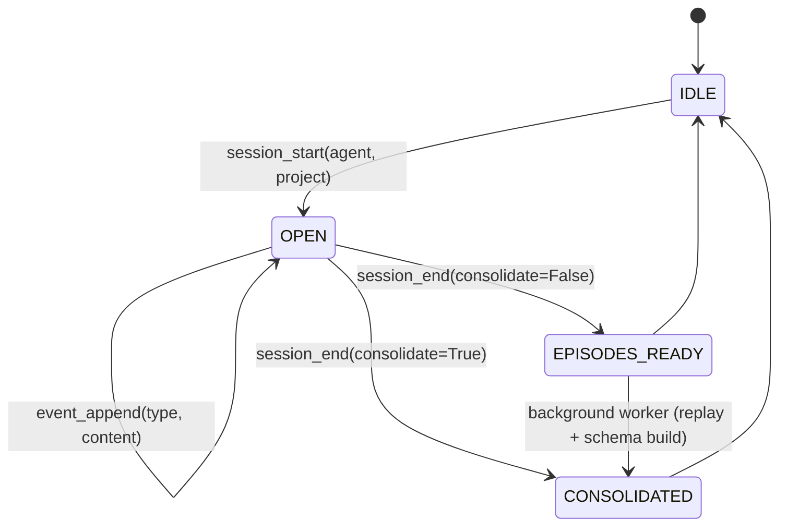

**State meanings:**

| State | Description |
|---|---|
| `IDLE` | No active session |
| `OPEN` | Session active; agent calls `event_append` per turn |
| `EPISODES_READY` | `session_end` returned; micro + macro episodes formed (<1 ms); schemas queued for background worker |
| `CONSOLIDATED` | Background worker completed replay; prototypes clustered and schemas available for recall |

### Session Lifecycle: Detailed Steps

#### 1. Explicit Protocol (Recommended for Agents)

```python
import slowave

# Start session
session_id = slowave.session_start(agent="my-agent", project="my-project")

# Log every user message and every assistant response
slowave.event(session_id, "user_message", "What databases should I use?")
slowave.event(session_id, "assistant_message", "For this workload, SQLite or PostgreSQL...")
slowave.event(session_id, "user_message", "What about Redis for cache?")
slowave.event(session_id, "assistant_message", "Redis is great for...")

# Optional: explicit memory
slowave.remember("User prefers SQLite for prototypes", type="decision", project="my-project")

# End session
# consolidate=False (default): episodes ready immediately, consolidation in background
slowave.session_end(session_id, consolidate=False)
```

**Advantages**:
- Explicit control over logging
- Guaranteed complete coverage (one call per turn)
- Works across process restarts (if session_id is persisted)

**Disadvantages**:
- Requires agent discipline (easy to forget a call)
- More verbose code

#### 2. Implicit Protocol (Option A, Convenience)

```python
import slowave

# Start implicit session (auto-logging enabled)
result = slowave.session_start_implicit(agent="my-agent", project="my-project")
session_id = result["session_id"]

# Agent works normally; outputs are auto-captured
# (No need to call slowave_event for each turn)

# Optionally: explicit memory still works
slowave.remember("User prefers SQLite for prototypes", type="decision", project="my-project")

# End implicit session
slowave.session_end_implicit()
```

**Advantages**:
- No logging discipline required
- Guaranteed complete coverage (auto-wrapping is involuntary, like RTK)
- Simpler code

**Disadvantages**:
- Per-process state (`_IMPLICIT_SESSIONS` dict); lost on restart
- Multi-client scenarios need careful session management
- Less control over what gets logged

### Consolidation Timing

**Option A: Non-blocking (default, recommended)**:
```python
session_end(consolidate=False)  # returns immediately
# Episodes are ready for recall right away
# Consolidation happens in background worker
# Schemas available seconds to minutes later
```

**Option B: Blocking**:
```python
session_end(consolidate=True)  # blocks until replay + consolidation complete
# Episodes and schemas both available on return
# Higher latency (~100ms to 1s per session, depending on replay batch size)
```

### Session Scoping & Isolation

Sessions are scoped by `(agent, project)` pair. To isolate memory between contexts:

```python
# Agent "alice" working on "project-x"
sid_alice = slowave.session_start(agent="alice", project="project-x")
slowave.event(sid_alice, "user_message", "How do I optimize queries?")
slowave.session_end(sid_alice)

# Agent "bob" working on "project-y"
sid_bob = slowave.session_start(agent="bob", project="project-y")
slowave.event(sid_bob, "user_message", "Set up my dev environment")
slowave.session_end(sid_bob)

# Recall is scoped: alice only sees project-x memories
slowave.recall("optimization", project="project-x")  # ← only alice's memories
```

### Multi-Turn Conversations

For long-running agents with many turns, batch sessions by semantic checkpoint:

```python
# Session 1: user interaction phase
sid1 = session_start(agent="chat-agent", project="doc-analysis")
for turn in conversation_phase_1:
    event(sid1, "user_message", turn.user_input)
    event(sid1, "assistant_message", turn.assistant_response)
session_end(sid1, consolidate=False)

# Session 2: schema refinement phase (independent task)
sid2 = session_start(agent="chat-agent", project="doc-analysis")
for turn in conversation_phase_2:
    event(sid2, "user_message", turn.user_input)
    event(sid2, "assistant_message", turn.assistant_response)
session_end(sid2, consolidate=False)

# Each session's memories are independent but both searchable under "doc-analysis"
recall("patterns in documents", project="doc-analysis")  # finds both sessions
```

### Long-Lived vs Session-Based Agents

**Session-based** (recommended):
- Agent processes one task, logs it, ends session
- Memories form immediately, available for next task
- Clear boundaries for consolidation

**Long-lived** (e.g., daemon):
- Agent never ends session; keeps appending events indefinitely
- Consolidation runs via the background worker (`slowave worker`) — not triggered via MCP
- Useful for stateful agents (chatbots, persistent assistants)
- Caveat: large sessions (1M+ events) may hit memory limits

For long-lived agents, periodically trigger consolidation:
```python
for turn in infinite_event_stream:
    event(session_id, "user_message", turn.input)
    event(session_id, "assistant_message", turn.output)
    
    if turn_count % 100 == 0:
        consolidate()  # trigger one replay cycle
```
