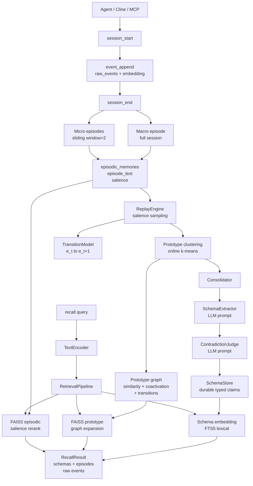
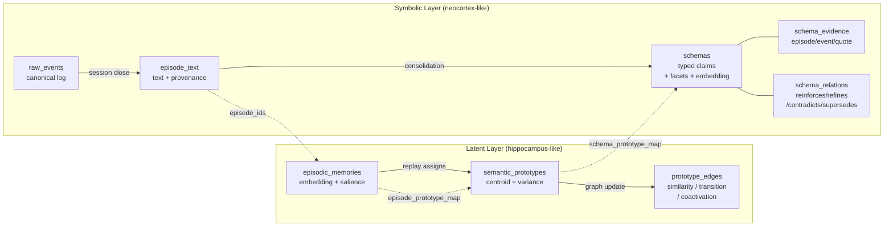
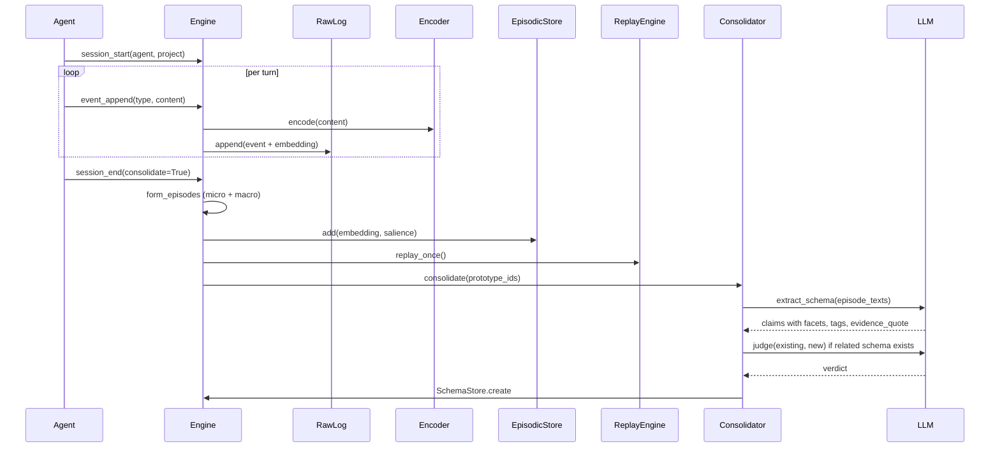
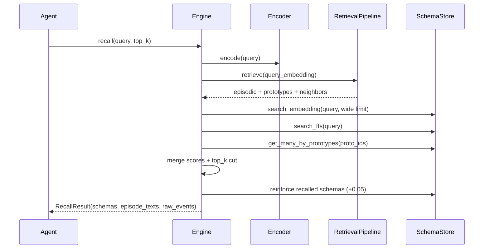
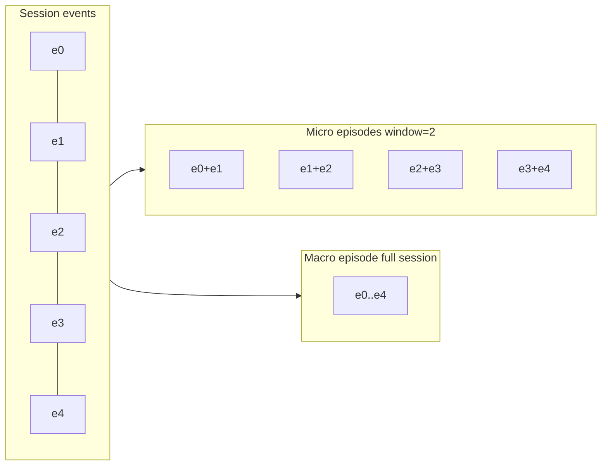
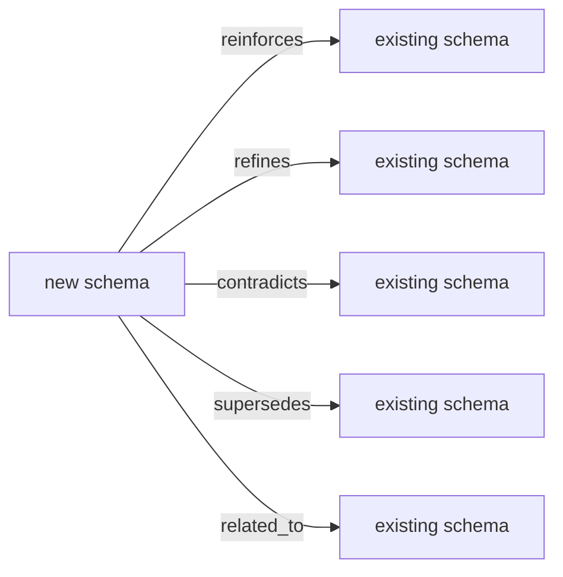
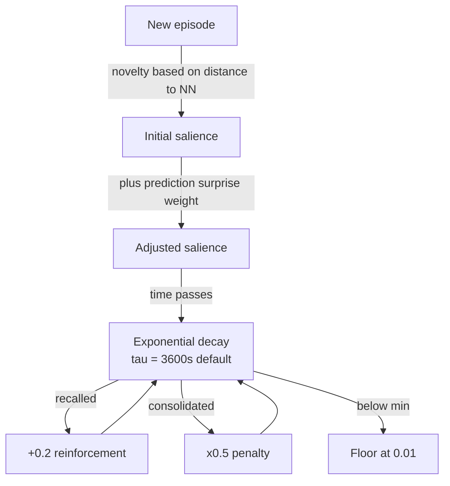
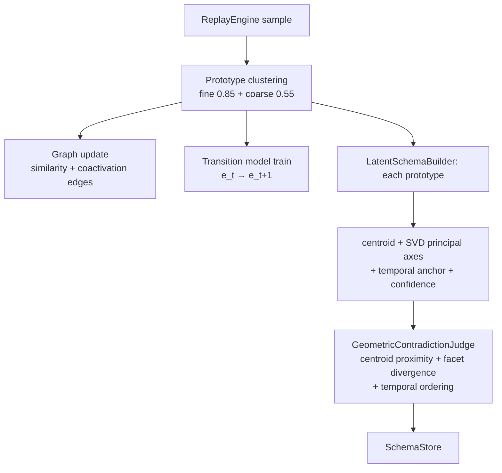
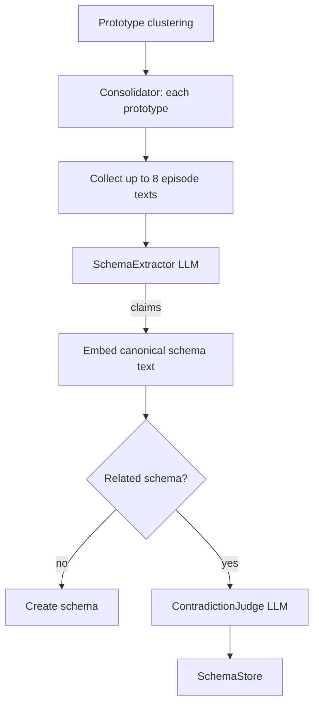
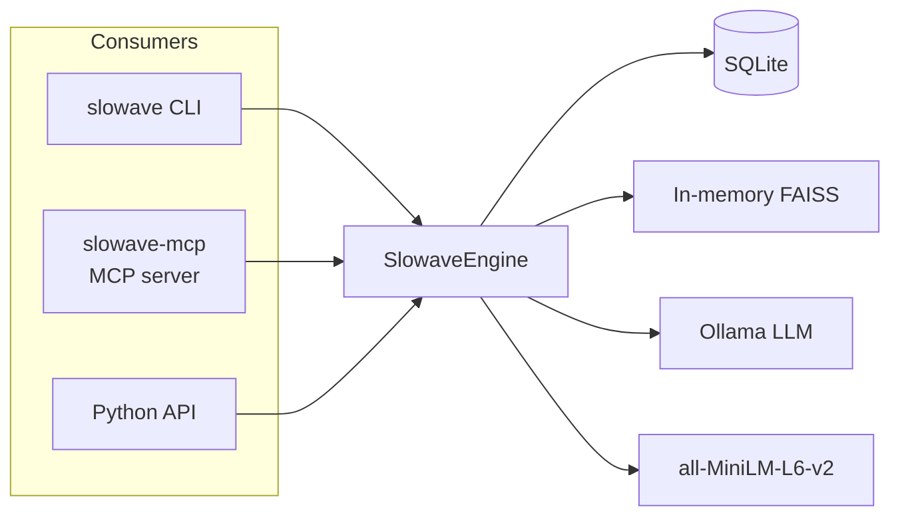

# Architecture

## Overview

```
raw_events  →  episodes (on session_end, <1ms, no LLM)
                  ↓ background worker
                  ↓ cluster into prototypes (fine 0.85 + coarse 0.55)
                  ↓ build latent schema (centroid + SVD axes + temporal anchor)
                  ↓ geometric contradiction detection
              prototype graph + latent schemas
                  ↓
              recall: cosine + predictive seed + spreading activation + multi-scale
```

**Episodes** form immediately on session close — sub-millisecond, no LLM.  
**Prototypes** cluster episodes offline at two scales: fine (CA3-like, exact) and coarse (CA1-like, generalising).  
**Latent schemas** are a deterministic geometric fingerprint of a prototype: centroid + SVD principal axes + temporal anchor. No LLM extraction.  
**Recall** is always LLM-free: FAISS at both scales + predictive transition seed + spreading activation over the prototype graph + salience rerank.

---

## 1. Design Philosophy

Slowave is built on the observation that existing open-source agent memory systems (Mem0, Letta, Zep, A-MEM) update memory **on write only**: ingest a fact, deduplicate, store. Slowave additionally models the key operations of biological memory:

| Biological principle | Slowave implementation |
|---|---|
| Episodic encoding at experience time | Raw events → micro/macro episodes on session close |
| Slow-wave sleep consolidation | Replay engine runs offline (background worker) |
| Semantic abstraction over episodes | Two-scale prototype clustering: fine (CA3, 0.85) + coarse (CA1, 0.55) |
| Schema formation (neocortex) | **Latent schema** (Stage 6): centroid + SVD facet axes + temporal anchor — no LLM |
| Predictive coding / surprise signal | Transition model predicts next episode embedding; surprise boosts salience |
| Ebbinghaus forgetting curve | Exponential salience decay between sessions |
| Memory reinforcement on use | Recall bumps salience of retrieved episodes/schemas |
| Contradiction / belief revision | Geometric contradiction: centroid proximity + facet divergence + temporal ordering — no LLM |
| Pattern completion | Spreading activation over prototype graph (Stage 1) |
| Provenance chain | Every schema traces back through episodes to raw events |

**Default path (Stage 6+) uses zero LLM calls.** The LLM extraction path (Stage 0-5) is preserved for comparison runs only.

The system is designed to generalise across agent types and benchmarks, not to overfit to any single evaluation.

---

## 2. High-Level Architecture



---

## 3. Memory Layers

Slowave has two distinct memory layers mirroring Complementary Learning Systems (CLS) theory.



### Latent layer components

| Component | Role |
|---|---|
| `EpisodicStore` | Stores per-episode float32 embeddings as SQLite BLOBs; rebuilt into FAISS for ANN search |
| `SemanticStore` | Stores prototype centroids updated by online incremental mean during replay |
| `GraphManager` | Sparse directed graph over prototypes; edges carry similarity, transition probability, coactivation |
| `TransitionModel` | Small linear layer trained on consecutive episode pairs; provides prediction error / surprise signal |
| `SalienceEngine` | Novelty, exponential decay, recall reinforcement, consolidation penalty |
| `ReplayEngine` | Orchestrates all latent-layer operations on session close |

### Symbolic layer components

| Component | Role |
|---|---|
| `RawLog` | Append-only event log; source of truth for all provenance |
| `EpisodeTextStore` | Text representation of each episodic memory + source event IDs |
| `SchemaStore` | Durable typed claims with flexible facets, canonical embedding, salience, status, evidence |
| `LatentSchemaBuilder` | **Default** — centroid + SVD principal axes + temporal anchor + confidence, no LLM |
| `GeometricContradictionJudge` | **Default** — centroid proximity + facet divergence + temporal ordering, no LLM |
| `SchemaExtractor` | Legacy (Stage 0-5, `--schema-mode llm`) — LLM call → `ExtractedSchema` objects |
| `ContradictionJudge` | Legacy (Stage 0-5) — LLM call → reinforces / refines / contradicts verdict |
| `Consolidator` | Orchestrates schema building (latent or LLM path) → SchemaStore |

---

## 4. Data Flow: Ingest



---

## 5. Data Flow: Recall



---

## 6. Episode Formation

On `session_end`, raw events are converted to episodic memories using a multi-scale strategy:



- **Micro episodes** preserve local context (individual user preferences, facts, decisions).
- **Macro episode** preserves global session context; downweighted salience (`×0.8`).
- **Salience** = novelty (distance to nearest existing episode) + 0.3 × prediction surprise.
- `remember:` events receive a salience bonus (`+0.6`) so explicit memories survive replay.

---

## 7. Schema Structure

A schema is a durable typed claim about the user or project, consolidated from episodic evidence.

```
Schema {
  content_text             str     ← human-readable claim
  facets {
    schema_class           str     ← fact | preference | habit | decision | constraint | ...
    scope                  str     ← domain/context
    polarity               str     ← positive | negative | neutral | mixed
    stability              str     ← one_off | recurring | current | historical
    positive               [str]   ← what to prioritise in future responses
    negative               [str]   ← what to avoid
    entities               [str]   ← salient named entities
    attributes             {str}   ← structured slots
  }
  tags                     [str]   ← compact search tags
  confidence               float   ← extractor confidence [0, 1]
  salience                 float   ← decays, reinforced on recall
  status                   str     ← active | needs_review | superseded | contradicted | archived
  embedding                blob    ← canonical schema text embedding (claim + facets + tags)
  schema_evidence          [...]   ← {episode_id, raw_event_id, quote, weight}
  schema_relations         [...]   ← {src, dst, relation, confidence, reason}
}
```

### Schema relations



### Canonical schema embedding

Schemas are embedded using **canonical schema text** — claim + facets + tags — so the embedding captures structured memory content, not only surface wording:

```
Claim: For running training advice, the user prefers plans adapted to their knee injury.
Class: preference
Scope: running training advice
Positive: knee-adapted plans, gradual mileage increases
Negative: generic high-mileage programmes
Entities: knee injury
Tags: running, training, injury, adaptation
```

---

## 8. Salience Dynamics



Salience governs replay sampling (proportional), retrieval reranking (`cosine + 0.3×salience`), and schema persistence (superseded schemas drop to `0.05`).

---

## 9. Consolidation Pipeline

**Default: brain-only (Stage 6+), zero LLM calls.**



**Legacy: LLM-extraction path (Stage 0-5, `--schema-mode llm`):**



---

## 10. Storage Layout

All data lives in a single **SQLite** file (WAL mode). Embeddings are stored as `BLOB` columns and loaded into **in-memory FAISS** indices on engine start.

```
slowave.db
├── latent layer
│   ├── episodic_memories        embedding + salience + metadata
│   ├── semantic_prototypes      centroid + variance + support_count
│   ├── episode_prototype_map    M:1 episode → prototype
│   └── prototype_edges          similarity / coactivation / transition weights
├── symbolic layer
│   ├── sessions
│   ├── raw_events               canonical event log + optional embedding
│   ├── episode_text             text + event provenance
│   ├── schemas                  claims + facets + canonical embedding + status
│   ├── schema_evidence          episode/event/quote links
│   ├── schema_prototype_map     M:M schema ↔ prototype
│   ├── schema_relations         schema graph edges
│   └── consolidation_debug      LLM prompt/response audit trail
└── FTS5 indices
    ├── schemas_fts
    ├── episodes_fts
    └── raw_events_fts
```

---

## 11. Integrations



MCP tools: `slowave_session_start`, `slowave_event`, `slowave_session_end`, `slowave_recall`, `slowave_remember`, `slowave_context`, `slowave_stats`, `slowave_consolidate`.

---

## 12. Key Configuration

```python
SlowaveConfig(
    db_path               = "~/.slowave/slowave.db",
    dim                   = 384,
    schema_mode           = "latent",   # brain-only default; "llm" for legacy path
    encoder               = EncoderConfig(model="all-MiniLM-L6-v2"),
    salience              = SalienceConfig(
        tau_seconds             = 3600.0,
        recall_reinforcement    = 0.2,
        consolidation_penalty   = 0.5,
    ),
    replay                = ReplayConfig(
        sample_size             = 256,
        max_prototypes_per_replay = 32,
        assignment_threshold    = 0.65,  # fine scale; coarse fixed at 0.55
    ),
    # LLM config only used when schema_mode = "llm":
    llm                   = LLMBackendConfig(model="qwen2.5:7b-instruct"),
)
```

---

## 13. Module Map

```
slowave/
├── core/
│   ├── config.py           SlowaveConfig
│   ├── engine.py           SlowaveEngine (public façade)
│   └── consolidation.py    Consolidator
├── latent/
│   ├── episodic_store.py
│   ├── semantic_store.py
│   ├── graph_manager.py
│   ├── replay_engine.py
│   ├── retrieval.py
│   ├── salience.py
│   ├── transition_model.py
│   └── types.py
├── symbolic/
│   ├── raw_log.py
│   ├── episode_text.py
│   ├── schema_store.py       SchemaStore + canonical_schema_text()
│   ├── schema_extractor.py   SchemaExtractor → ExtractedSchema
│   ├── contradiction.py      ContradictionJudge
│   └── encoder.py
├── llm/
│   ├── base.py
│   ├── ollama_backend.py
│   └── prompts/
│       ├── extract_schema.txt
│       └── judge_contradiction.txt
├── storage/
│   ├── sqlite_db.py
│   └── schema.sql
├── cli/main.py
└── mcp/server.py
```

---

## 14. Biological Analogies

| Slowave component | Biological analogue |
|---|---|
| `raw_events` | Sensory input / working memory |
| `episodic_memories` | Hippocampal episodic traces |
| `semantic_prototypes` | Cortical category representations |
| `prototype_edges` | Associative cortical connectivity |
| `transition_model` | Predictive coding / sequence learning |
| Replay engine | Slow-wave sleep / hippocampal sharp-wave ripples |
| `schemas` | Neocortical long-term semantic knowledge |
| Salience decay | Forgetting curve (Ebbinghaus) |
| Recall reinforcement | Memory reconsolidation / use-dependent strengthening |
| Contradiction judge | Belief revision / predictive error correction |
| Evidence provenance | Episodic trace back to sensory context |
