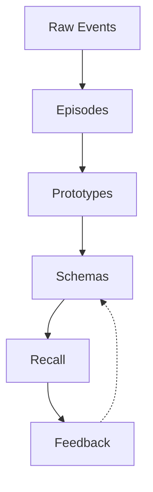

# Architecture

## Overview

Slowave is a local-first adaptive memory system inspired by how biological memory evolves through experience, consolidation, recall, and feedback.

Unlike traditional agent memory systems that primarily store facts, Slowave continuously reorganizes memory through replay, abstraction, reinforcement, decay, and belief revision.

All core memory operations run locally without LLM calls.

---

## Core Principles

### Episodic Memory

Events generated during a session are transformed into episodes.

Episodes represent individual experiences and serve as the foundation for future consolidation.

### Semantic Memory

Over time, related episodes are consolidated into semantic prototypes and schemas.

These abstractions capture recurring patterns, decisions, preferences, constraints, and knowledge that persist across sessions.

### Recall Changes Memory

Retrieved memories are not passive.

Successful recalls reinforce useful memories while feedback can suppress, revise, or mark memories for review.

### Time Matters

Memory strength evolves over time.

Frequently used memories become more prominent while stale information gradually loses influence.

### Local First

All storage, indexing, consolidation, and retrieval occur locally.

No external memory service or cloud backend is required.

---

## Memory Layers

### Episodic Layer

Stores individual experiences together with embeddings, salience information, and provenance.

Responsibilities:

- Experience storage
- Recent memory retrieval
- Replay source material
- Provenance tracking

### Semantic Layer

Stores consolidated prototypes and schemas derived from repeated experiences.

Responsibilities:

- Long-term knowledge
- Pattern abstraction
- Contradiction handling
- Preference and decision persistence

### Behavioral Patterns

Recurring workflows emerge implicitly — no explicit procedural store. Strong prototype-to-prototype transitions and co-activated schema clusters capture repeated behavioral structure.

Responsibilities:

- Pattern emergence via prototype transition graph (w_transition weights)
- Predictive recall: TransitionModel surfaces "what tends to come next"
- Co-activation of related constraints and preferences
- Habit formation through salience strengthening over repeated episodes

---

## Memory Generalization

Memories in Slowave are initially scoped to the context where they were formed.

Over time, memories that prove useful across multiple different contexts are gradually promoted to broader visibility. This happens automatically, based on observed recall patterns — no manual tagging or LLM classification is involved.

The system tracks how often a memory is retrieved across different scopes and scope kinds. Memories recalled consistently across diverse contexts are progressively made available to a wider range of future contexts.

This mirrors how the human brain generalizes: repeated successful activation across varied situations strengthens a memory's domain-independence, while memories that remain relevant only in a specific context stay scoped to that context.

The boundary between scoped and general is not hard — it is earned through use.

---

## Recall Pipeline

Recall combines multiple complementary mechanisms:

- Semantic similarity search
- Multi-scale memory retrieval
- Associative graph expansion
- Salience-aware ranking
- Temporal awareness

These mechanisms work together to retrieve both exact memories and related knowledge.

---

## Feedback Loop

Slowave supports explicit retrieval feedback.

Agents can indicate when memories were:

- Useful
- Irrelevant
- Stale
- Incorrect
- Missing

Feedback influences future retrieval and consolidation decisions.

---

## Working Memory

Long-term memory is filtered before being injected into an agent context.

Only a compact, relevant subset of memory is surfaced, helping reduce prompt size while maintaining continuity across sessions.

---

## Storage

Slowave uses:

- SQLite for durable storage
- FAISS for vector retrieval
- Local embedding models
- Background consolidation workers

All components operate entirely on-device.

---

## Integrations

Slowave can be used through:

- MCP
- Python API
- CLI

Memory can therefore be shared across multiple agents, coding assistants, and chat applications while remaining in a single local store.

---

## Design Goals

- Zero LLM calls in the memory loop
- Local-first operation
- Deterministic consolidation
- Continuous adaptation
- Explainable memory evolution
- Cross-agent memory sharing
- Low latency retrieval

---

## What Slowave Is Not

Slowave is not:

- A vector database
- A chat history store
- A cloud memory service
- A RAG framework

It is an adaptive memory system focused on long-term knowledge formation and reuse.
