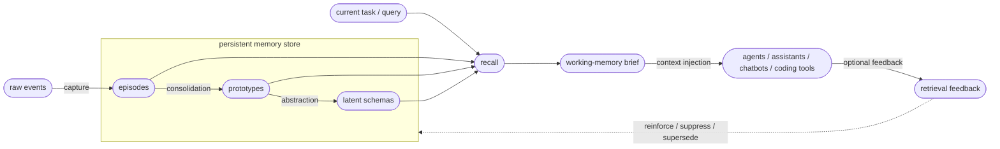

# Brain-Inspired Memory Architecture

Slowave is a centralized, adaptive memory substrate shared across AI tools.

It gives different assistants, coding agents, chat clients, and MCP-compatible tools access to the same persistent memory layer instead of each tool keeping its own isolated memory.

It is built around one core idea:

> **Memory is a latent process before it is a language process.**

Slowave stores and updates memory through local embeddings, timestamps, scopes, salience, reinforcement, decay, supersession, and graph relationships. Only after retrieval does it render selected memory as natural language for a human, agent, chatbot, coding assistant, or language model.

The architectural separation is simple:

> Use language models for language.  
> Use memory mechanisms for memory.
> Use one shared memory layer across tools, not one fragmented memory per tool.

Slowave is not a replacement for a language model, a reasoning engine, or an autonomous agent framework. It is the persistent memory layer those systems can use. The downstream client remains responsible for reasoning, planning, answer construction, tool execution, and final user-facing behavior.

---

## Problem Statement

Most AI tools still treat memory as one of three things:

- a transcript of previous messages;
- a static note store;
- an LLM-generated summary of past interactions;
- a tool-specific memory silo that disappears when the user switches clients.

Those approaches can work, but they have drawbacks. They often depend on remote model calls, grow with conversation length, are difficult to inspect, and are tied to one assistant or vendor.

Slowave takes a different path.

It treats memory as a local adaptive system. Events are encoded, associated, reinforced, weakened, revised, consolidated, and retrieved before they are verbalized.

This is the central product idea behind Slowave: memory should live outside any single tool.

A coding assistant, chat client, terminal agent, desktop assistant, or future model should be able to connect to the same memory substrate. The user should not lose continuity just because they switch from one tool to another.

The design target is not to maximize every benchmark score. The design target is to provide a private, local, inspectable, reusable memory substrate that improves continuity over repeated use.

---

## What Slowave Is

Slowave is a shared memory substrate for repeated AI use across multiple tools.

It is designed to help AI tools remember context that remains useful across sessions, such as:

- project decisions;
- user preferences;
- recurring workflows;
- tool conventions;
- architectural choices;
- prior debugging context;
- long-running task history.

The important point is that these memories are not locked inside one assistant. A decision remembered through one client can later be recalled by another client, as long as both use the same Slowave memory store.

Instead of replaying entire histories into every prompt, Slowave retrieves a compact working-memory brief for the current task.

The goal is not to remember everything with equal priority.

The goal is to remember what remains useful.

---

## Boundaries

Slowave intentionally keeps memory separate from reasoning.

It is not:

- a language model;
- a general reasoning engine;
- a full autonomous agent framework;
- a cloud-hosted managed memory service;
- a natural-language summarization engine;
- a replacement for application-specific business logic;
- a guarantee of maximum benchmark accuracy;
- a system that can decide by itself whether a remembered fact is true in the outside world.

Higher-order reasoning, planning, synthesis, and final answer construction still belong to the downstream model or application.

Slowave provides persistent context. The client decides how to use it.

---

## Why Not LLM-Driven Memory?

Many modern memory systems use language models as memory operators.

A language model may be asked to:

- extract facts;
- summarize conversations;
- merge memories;
- reflect on past sessions;
- rewrite stored knowledge;
- rerank retrieved context.

Slowave avoids making that the default memory loop.

The core memory path does not require LLM calls to ingest, consolidate, retrieve, rank, decay, supersede, or render working-memory briefs.

This does not mean Slowave avoids language models. Slowave is built to support language-model-powered tools. The difference is that the memory layer itself does not depend on an LLM provider, API key, hosted model, or cloud memory service.

This keeps the default memory layer:

- local-first;
- low-latency;
- reproducible;
- inspectable;
- inexpensive to run;
- portable across tools;
- independent from any specific model vendor.

---

## Memory Before Language

Human memory is not an append-only transcript of sentences.

Experiences are encoded, associated, reinforced, reorganized, weakened, and recalled before they are verbalized.

Slowave follows that principle at the system level.

Incoming events are converted into local memory representations. Retrieval is shaped by semantic similarity, time, scope, salience, reinforcement, decay, supersession, and graph relationships. Only after recall does Slowave render selected memory into language, usually as a compact working-memory brief.

This keeps the memory layer independent from the reasoning layer.

The same memory store can support different clients, models, and tools without being tied to one assistant or one LLM provider.

---
## System Architecture

Slowave is organized around one persistent memory store shared by many possible clients, and two interacting loops:

1. **Consolidation loop** — past activity is encoded and consolidated into memory.
2. **Recall loop** — the current task retrieves compact working context.

Feedback from use can then update future retrieval.

Multiple clients can read from and write to the same memory store. Slowave is therefore not only local memory, but centralized memory at the user or workspace level.

The left side shows consolidation: raw events become episodes, related episodes can form prototypes, and stable repeated patterns can become latent schemas.

The right side shows use: the current task triggers recall, recall produces a compact working-memory brief, and the brief is injected into the downstream agent or assistant.

Feedback closes the loop by reinforcing useful memories, suppressing irrelevant ones, and helping future retrieval adapt over time.

---

## Core Memory Mechanisms

Slowave borrows practical ideas from cognitive memory and translates them into local software mechanisms.

### Encoding

Incoming events are embedded, timestamped, scoped, and stored locally as memory candidates.

Encoding is the entry point of memory. It turns observed activity into retrievable local state without requiring an LLM call.

### Consolidation

Related memories can be grouped into prototypes, allowing repeated experiences to form more stable patterns over time.

Consolidation helps Slowave move beyond isolated events while avoiding the need for language-model summarization in the memory loop.

### Reinforcement

Frequently recalled or positively used memories gain influence.

A memory that repeatedly helps across sessions should become easier to retrieve. A memory that is never used should not keep competing with more useful context forever.

### Decay

Unused, stale, or low-salience memories gradually lose retrieval priority.

Decay affects ranking and activation. It does not necessarily mean immediate physical deletion.

The goal is to keep old information available when needed, while preventing stale context from dominating new tasks.

### Supersession

Newer information can weaken or replace outdated information instead of allowing contradictions to accumulate indefinitely.

For example, if a project decision changes, Slowave should not keep presenting the old decision as equally valid.

Supersession lets memory revise itself over time.

### Pattern Completion

Partial cues can retrieve related memories.

This helps agents recover useful context without replaying full history. A query does not need to exactly match a stored memory if the surrounding latent pattern is relevant.

### Pattern Separation

Similar but distinct contexts are kept apart where possible, reducing accidental cross-project or cross-task leakage.

Scopes bias activation toward the current context, for example:

- `project:x`
- `domain:y`
- `workflow:z`
- `relationship:a`
- unscoped or general memory

Scopes are soft boundaries, not hard walls.

This allows Slowave to preserve project-specific context while still letting broadly useful memory surface when appropriate.

---

## Scope and Cross-Scope Generalization

Slowave uses scopes to bias memory retrieval toward the current context.

A memory stored under `project:alpha` should usually be more relevant inside `project:alpha` than inside `project:beta`.

However, useful memory is not always confined to one scope.

A coding preference, repeated workflow, architectural lesson, or tool convention may start inside one project but become useful across many projects.

Slowave supports this with soft cross-scope generalization:

- project-specific facts remain mostly local;
- reusable preferences can become broader;
- repeated workflows strengthen prototype transition paths;
- memories successfully recalled across scopes can gain broader activation;
- irrelevant cross-scope matches can be suppressed through feedback.

The goal is to reduce accidental leakage without preventing useful transfer.

Scopes protect context, but they do not prevent learning.

This is a soft mechanism, not a perfect isolation guarantee. Applications that need strict separation between users, tenants, clients, or confidential projects should use separate storage, separate profiles, or additional access-control boundaries outside Slowave.

---

## Working-Memory Brief

Slowave does not inject the entire memory store into an agent.

Instead, it builds a compact working-memory brief for the current task.

The brief is designed to be:

- query-aware;
- scope-aware;
- salience-ranked;
- compact;
- readable by humans and language models;
- bounded in size.

This is the bridge between memory and language.

Slowave performs retrieval locally, then renders only selected context as language at the system boundary.

This avoids replaying entire histories into every prompt.

The brief should be treated as retrieved context, not as ground truth. The downstream model or application should still decide how much of the recalled context is relevant to the task.

---

## Behavioral Patterns

Not all useful memory is factual.

Some memory is behavioral: repeated ways of doing things that shouldn't need to be re-stated every session.

Examples include:

- how a project is usually tested;
- how a release checklist is performed;
- how a recurring debugging workflow works;
- how a specific user prefers documentation to be reviewed;
- how an agent should prepare context before editing a repository.

Slowave captures these patterns implicitly — not as explicit procedures, but through the structure that consolidation produces. Repeated episodes strengthen prototype-to-prototype transition weights. The TransitionModel reads these weights at recall time to surface "what tends to come next" as a predictive signal alongside regular cosine retrieval.

Explicit instructions ("run tests before pushing") are stored as constraint schemas and recalled when relevant. Observed repetition reinforces the transition graph. Over time, both signals converge: the recalled constraint and the predicted next-state point in the same direction without any procedural store.

This approach treats behavioral structure as emergent rather than declared. The LLM remains the decision-maker; Slowave supplies context about what has tended to work.

---

## Benefits of the Approach

### Cross-Tool Continuity

The main benefit of Slowave is that memory is centralized outside individual tools.

A user can remember something from one assistant, retrieve it from another, and continue work without rebuilding context from scratch.

This is especially useful for workflows that move between chat clients, coding agents, terminal tools, desktop assistants, and future MCP-compatible applications.

### Predictable Cost

Recall and context generation do not require per-query LLM calls.

Memory cost is not tied to model pricing, remote inference, or context-window replay.

### Privacy

Memory can stay entirely in the local environment.

Slowave does not require sending stored memories to a hosted memory provider.

Local-first does not mean encrypted-by-default. Users should protect the local database, backups, logs, and exported artifacts according to their security needs.

### Low Latency

Recall runs through local retrieval and deterministic ranking rather than remote model inference.

This makes memory access fast enough for interactive AI tools and coding assistants.

### Reproducibility

Because retrieval is based on local state and deterministic ranking signals, behavior is easier to inspect and reproduce than LLM-mediated memory rewriting.

The same memory state and query path can produce stable retrieval behavior.

### Portability

The same memory store can be reused across coding agents, chatbots, desktop assistants, terminal agents, and other MCP-compatible tools.

Slowave is not a memory feature embedded inside one assistant. It is a centralized memory layer that different clients can use.

This makes the memory portable across interfaces and resilient to model or tool changes.

### Vendor Independence

The memory layer does not depend on a specific hosted model, API key, or cloud memory service.

The reasoning layer can change while the memory layer remains persistent.

---

## Trade-Offs

Slowave intentionally prioritizes:

- locality;
- privacy;
- transparency;
- deterministic behavior;
- resource efficiency;
- long-term adaptation;
- cross-tool portability.

Those choices create trade-offs.

Slowave does not use an LLM to reinterpret every memory operation. It does not automatically synthesize final answers from memory. It does not guarantee that every recalled item is useful. It can still retrieve stale, irrelevant, outdated, overly broad, or overly local context when the available signals are ambiguous.

This is why feedback, scopes, decay, supersession, and client-side reasoning remain important.

Slowave focuses on the adaptive memory substrate that supports cognition: persistent context, temporal continuity, recall, forgetting, reinforcement, supersession, and cross-session adaptation.

---

## What Slowave Optimizes For

Slowave is optimized for repeated AI use where context must persist across sessions, models, and tools.

The most important use case is cross-tool continuity: the same memory should support different AI clients instead of being trapped inside one of them.

It is a generic memory substrate. Context is organized by flexible scopes, not hardcoded to one domain such as coding.

Scopes can represent:

- projects;
- domains;
- workflows;
- clients;
- relationships;
- tools;
- unscoped general memory.

The main target use cases are:

- coding assistants;
- AI chat clients;
- local agents;
- long-running workflows;
- cross-tool context reuse;
- scoped project memory;
- personal AI workspaces;
- team or role-based memory systems.

Instead of replaying entire histories into every prompt, Slowave retrieves a compact working-memory brief containing the most relevant context for the current task.

---

## Design Principles

Slowave is guided by a small set of principles:

- Evolve memory through use.
- Strengthen frequently useful information.
- Reduce the influence of stale or unused information.
- Supersede outdated information instead of accumulating contradictions.
- Surface behavioral patterns from repeated workflows.
- Keep memory local, inspectable, and portable.
- Avoid dependency on any specific model vendor.
- Inject context selectively instead of replaying history wholesale.
- Support multiple tools through one shared memory substrate.
- Keep the reasoning layer interchangeable.

---

## Positioning

Slowave is not trying to become the reasoning layer.

It is a centralized, reusable memory layer for systems that need persistent context across sessions, tools, and models.

The reasoning layer remains interchangeable.

The memory layer remains persistent.

The client can change. The model can change. The interface can change. The memory remains available.

This also means Slowave should be evaluated as a memory substrate: by continuity, retrieval quality, suppression of stale context, scope behavior, feedback adaptation, portability, and operational reliability.

This separation is deliberate.

It allows Slowave to act as a local, adaptive second brain for agents, assistants, and tools without turning memory itself into another LLM-dependent pipeline.

---

## Design Goal

Slowave’s goal is to make memory useful over time.

Useful memory should strengthen.

Stale memory should lose priority.

Outdated memory should be revised or superseded.

Repeated workflows should become easier to reuse.

Relevant context should be retrieved when needed without replaying everything that ever happened.

That is the design goal behind Slowave.