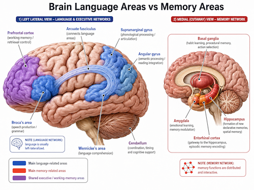
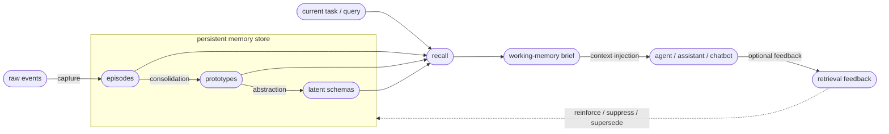

# Brain-Inspired Memory Architecture

Slowave is a local, adaptive memory substrate for AI tools.

It is built around one core idea:

> **Memory is a latent process before it is a language process.**

In practical terms, Slowave stores and updates memory through local embeddings, timestamps, scopes, salience, reinforcement, decay, supersession, and graph relationships before rendering anything as natural language.

Language is treated as a boundary format: a way to expose retrieved memory to humans, agents, coding assistants, chatbots, and language models.

The architectural separation is simple:

> Use language models for language.  
> Use memory mechanisms for memory.

---

## What This Means

Slowave does not treat memory as an append-only transcript, a static note file, or a set of LLM-generated summaries.

Instead, it treats memory as an evolving local system:

- events become memories;
- repeated memories can consolidate into more stable patterns;
- useful memories gain influence;
- stale memories lose priority;
- outdated memories can be superseded;
- current tasks retrieve only the most relevant context.

Slowave is brain-inspired, not a biological simulation.

The goal is not to reproduce the brain. The goal is to translate useful memory principles — consolidation, salience, decay, reinforcement, pattern completion, pattern separation, and forgetting — into a practical memory layer for AI tools.

---

## Why Not LLM-Driven Memory?

Many AI memory systems treat memory as a language-processing problem.

They may use language models to:

- extract facts;
- summarize conversations;
- merge memories;
- reflect on past sessions;
- rewrite stored knowledge;
- rerank retrieved context.

Slowave takes a different path.

The default memory loop is LLM-free: Slowave does not require LLM calls to ingest, consolidate, retrieve, rank, decay, supersede, or render memory briefs.

This does not mean Slowave avoids language models.

Slowave is designed to support language-model-powered tools. The difference is that the memory core itself does not depend on an LLM provider, API key, hosted model, or cloud memory service.

This makes the memory layer easier to keep:

- local-first;
- low-latency;
- reproducible;
- inspectable;
- inexpensive to run;
- portable across tools;
- independent from any specific model vendor.

---

## Memory Before Language

Human memory is not best understood as an append-only transcript of sentences.

Experiences are encoded, associated, reinforced, reorganized, weakened, and recalled before they are verbalized.

Slowave follows this principle at the system level.

Events are stored as local memory representations and later shaped by consolidation, salience, reinforcement, decay, supersession, and retrieval feedback.

Only after recall does Slowave render selected memory into language, usually as a compact working-memory brief.

This keeps the memory layer independent from the reasoning layer.

The same memory store can support different clients, models, and tools without being tied to one assistant or one LLM provider.

---

## System Architecture

Slowave has one persistent memory store and two interacting loops:

1. **Consolidation loop** — past activity is encoded and consolidated into memory.
2. **Recall loop** — the current task retrieves compact working context.

Feedback from use can then update future retrieval.

The left side shows consolidation: raw events become episodes, related episodes can form prototypes, and stable repeated patterns can become latent schemas.

The right side shows use: the current task triggers recall, recall produces a compact working-memory brief, and the brief is injected into the downstream agent or assistant.

Feedback closes the loop by reinforcing useful memories, suppressing irrelevant ones, and helping future retrieval adapt over time.

---

## Core Memory Mechanisms

Slowave borrows practical ideas from cognitive memory and translates them into local software mechanisms.

### Encoding

Incoming events are embedded, timestamped, scoped, and stored locally as memory candidates.

Encoding is the entry point of memory. It turns observed activity into retrievable local state without requiring an LLM call.

### Consolidation

Related memories can be grouped into prototypes, allowing repeated experiences to form more stable patterns over time.

Consolidation helps Slowave move beyond isolated events while avoiding the need for language-model summarization in the memory loop.

### Reinforcement

Frequently recalled or positively used memories gain influence.

A memory that repeatedly helps across sessions should become easier to retrieve. A memory that is never used should not keep competing with more useful context forever.

### Decay

Unused, stale, or low-salience memories gradually lose retrieval priority.

Decay affects ranking and activation. It does not necessarily mean immediate physical deletion.

The goal is to keep old information available when needed, but prevent stale context from dominating new tasks.

### Supersession

Newer information can weaken or replace outdated information instead of allowing contradictions to accumulate indefinitely.

For example, if a project decision changes, Slowave should not keep presenting the old decision as equally valid.

Supersession lets memory revise itself over time.

### Pattern Completion

Partial cues can retrieve related memories.

This helps agents recover useful context without replaying full history. A query does not need to exactly match a stored memory if the surrounding latent pattern is relevant.

### Pattern Separation

Similar but distinct contexts are kept apart where possible, reducing accidental cross-project or cross-task leakage.

Scopes bias activation toward the current context, for example:

- `project:x`
- `domain:y`
- `workflow:z`
- `relationship:a`
- unscoped/general memory

Scopes are soft boundaries, not hard walls.

This allows Slowave to preserve project-specific context while still letting broadly useful memory surface when appropriate.

---

## Scope and Cross-Scope Generalization

Slowave uses scopes to bias memory retrieval toward the current context.

A memory stored under `project:alpha` should usually be more relevant inside `project:alpha` than inside `project:beta`.

However, useful memory is not always confined to one scope.

A coding preference, repeated workflow, architectural lesson, or tool-specific convention may start inside one project but become useful across many projects.

Slowave supports this with soft cross-scope generalization:

- project-specific facts remain mostly local;
- reusable preferences can become broader;
- repeated workflows can consolidate into procedures;
- memories recalled successfully across scopes can gain broader activation;
- stale or irrelevant cross-scope matches can be suppressed through feedback.

The goal is to reduce accidental leakage without preventing useful transfer.

In other words, scopes protect context, but they do not prevent learning.

---

## Working-Memory Brief

Slowave does not inject the entire memory store into an agent.

Instead, it builds a compact working-memory brief for the current task.

The brief is designed to be:

- query-aware;
- scope-aware;
- salience-ranked;
- compact;
- readable by humans and language models;
- bounded in size.

This is the bridge between memory and language.

Slowave performs memory retrieval locally, then renders only the selected context as language at the boundary of the system.

This avoids replaying entire histories into every prompt.

---

## Procedural Memory

Not all useful memory is factual.

Some useful memory is procedural: repeated ways of doing things.

Examples:

- how a project is usually tested;
- how a release checklist is performed;
- how a recurring debugging workflow works;
- how a specific user prefers documentation to be reviewed;
- how an agent should prepare context before editing a repository.

Slowave treats repeated workflows as candidates for procedural memory.

The long-term goal is for successful repeated behavior to become easier to reuse, without requiring the user to restate the same process every time.

---

## Benefits of the Approach

### Predictable Cost

Recall and context generation do not require per-query LLM calls.

Memory cost is not tied to model pricing, remote inference, or context-window replay.

### Privacy

Memory can stay entirely in the local environment.

Slowave does not require sending stored memories to a hosted memory provider.

### Low Latency

Recall runs through local retrieval and deterministic ranking rather than remote model inference.

This makes memory access fast enough for interactive AI tools and coding assistants.

### Reproducibility

Because retrieval is based on local state and deterministic ranking signals, behavior is easier to inspect and reproduce than LLM-mediated memory rewriting.

The same memory state and query path can produce stable retrieval behavior.

### Portability

The memory store can be reused across coding agents, chatbots, desktop assistants, and other MCP-compatible tools.

Slowave is not a memory feature embedded inside one assistant. It is a shared memory layer that different clients can use.

### Vendor Independence

The memory layer does not depend on a specific hosted model, API key, or cloud memory service.

The reasoning layer can change while the memory layer remains persistent.

---

## Trade-Offs

Slowave intentionally prioritizes:

- locality;
- privacy;
- transparency;
- deterministic behavior;
- resource efficiency;
- long-term adaptation;
- cross-tool portability.

It does not optimize for everything.

Slowave is not:

- a replacement for a language model;
- a general reasoning engine;
- a full autonomous agent framework;
- a cloud-hosted managed memory service;
- a natural-language summarization engine;
- a guarantee of maximum benchmark accuracy.

Some higher-order reasoning tasks are still better handled by language models or other reasoning systems.

Slowave focuses on the adaptive memory substrate that supports cognition: persistent context, temporal continuity, recall, forgetting, reinforcement, supersession, and cross-session adaptation.

---

## What Slowave Optimizes For

Slowave is optimized for repeated AI use where context must persist across sessions and tools.

It is a generic memory substrate. Context is organized by flexible scopes, not hardcoded to one domain such as coding.

Scopes can represent:

- projects;
- domains;
- workflows;
- clients;
- relationships;
- tools;
- unscoped general memory.

The main target use cases are:

- coding assistants;
- AI chat clients;
- local agents;
- long-running workflows;
- cross-tool context reuse;
- scoped project memory;
- personal AI workspaces;
- team or role-based memory systems.

Instead of replaying entire histories into every prompt, Slowave retrieves a compact working-memory brief containing the most relevant context for the current task.

The goal is not to preserve everything with equal priority.

The goal is to remember what remains useful.

---

## Design Principles

Slowave is guided by a small set of principles:

- Evolve memory through use.
- Strengthen frequently useful information.
- Reduce the influence of stale or unused information.
- Supersede outdated information instead of accumulating contradictions.
- Consolidate repeated workflows into reusable procedures.
- Keep memory local, inspectable, and portable.
- Avoid dependency on any specific model vendor.
- Inject context selectively instead of replaying history wholesale.
- Support multiple tools through one shared memory substrate.
- Keep the reasoning layer interchangeable.

---

## Positioning

Slowave is not a replacement for language models.

It is not trying to become the reasoning layer.

It is a reusable memory layer for systems that need persistent context across sessions, tools, and models.

The reasoning layer remains interchangeable.

The memory layer remains persistent.

This separation is deliberate.

It allows Slowave to act as a local, adaptive second brain for agents, assistants, and tools without turning memory itself into another LLM-dependent pipeline.

---

## Design Goal

Slowave’s goal is to make memory useful over time.

Useful memory should strengthen.

Stale memory should lose priority.

Outdated memory should be revised or superseded.

Repeated workflows should become easier to reuse.

Relevant context should be retrieved when needed without replaying everything that ever happened.

That is the design goal behind Slowave.